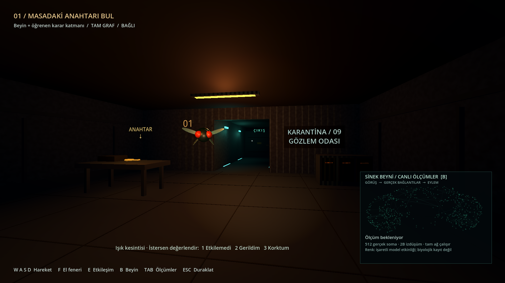

# FLYFEAR

**[Tarayıcıda oyna → furkancakir.dev/flyfear/](https://furkancakir.dev/flyfear/)**

Tarayıcıda ve macOS ARM64 üzerinde çalışan birinci şahıs korku oyunu prototipi. İnsan anahtarı bulup koridordaki kilitli çıkışı açar. **Odada fiziksel bir sinek uçar, oyuncuyu görüş alanıyla izler; gerçek bağlantı verisinden türetilen simülasyon uçuşunu etkiler ve korku olaylarını seçer.** Normal oyunda öğrenme her zaman açıktır. Web oyuncuları sunucudaki ortak karar katmanını günceller; masaüstü sürümü deneyimlerini kendi Mac’inde saklar.

Bu klasörde çalıştırılmış bir Godot oyunu, gerçek veri, ayrı Python simülasyonu, testler ve ölçüm raporları vardır. Ekran görüntüsü: [1080p oyun](reports/game-1080p.png). Güncel öğrenme: [v3 eğitim ve doğrulama raporu](reports/learning-v3/README.md). Önceki ölçümler: [performans raporu](reports/PERFORMANCE.md).

| Proje özeti | Durum |
|---|---|
| Platform | WebGL 2 tarayıcı + klavye/fare; ayrıca macOS ARM64 |
| Oyun motoru | Godot 4.5.2, hafif 3B, birinci şahıs |
| Beyin verisi | MaleCNS v1.0; 166.700 nöron, 25.582.938 yönlü bağlantı |
| Öğrenme | Sinir çıktılarından olay seçen, ödülle güncellenen dış karar katmanı v3 |
| Ön eğitim | 48 yapay oyuncu, 576 tur, 8.640 ödüllü olay |
| Kişiselleşme | Oyun içi hareketler ve isteğe bağlı 1 / 2 / 3 değerlendirmeleri |
| Çalışma biçimi | Web: HTTPS/WSS ve sunucuda CPU; masaüstü: yalnızca localhost |
| Son doğrulama | 12 Python/sunucu testi, 17 ayar kontrolü, 112 ses/oynanış ve anahtar arama, 24 beyin görünümü ve 48 tam tur kontrolü geçti |

Son [genel performans optimizasyonu](reports/optimization/README.md): daha hızlı
beyin yükleme, daha düşük bellek, değişiklik olduğunda yenilenen ağ çizimi ve
daha küçük sinir ölçümü mesajları. Tam grafiğin dinamiği ve öğrenme korunur.



## Web sürümü

Kurulumsuz oyun: **https://furkancakir.dev/flyfear/**. Güncel, WebGL 2 ve SharedArrayBuffer destekleyen bir masaüstü tarayıcı, klavye ve fare gerekir. Dokunmatik kontroller eklenmedi. İlk sıkıştırılmış indirme yaklaşık 9 MiB. İnternet bağlantısı oyun boyunca gereklidir.

166.700 nöronun tamamı sunucuda hesaplanır. Oyuncular aynı bağlantı grafiğini kullanır fakat her birinin sinir durumu ayrıdır; geçerli hareket tepkileri ve isteğe bağlı değerlendirmeler aynı kalıcı karar katmanını günceller. Yeniden bağlantı, yeni ziyaretçi ve hizmet yeniden başlatması ortak modeli silmez. Öğrenmenin ilerlemesi her turda daha güçlü korku garantisi değildir.

Başlatmadan önce veri kullanımı açıklanır. Ham hareket akışı, IP, e-posta veya tarayıcı kimliği oyun günlüğüne yazılmaz; kamera ve mikrofon kullanılmaz. Ayrıntılı olay kayıtları yaklaşık 20 MB ile sınırlıdır; öğrenilmiş model korunur. [Veri kullanımı](https://furkancakir.dev/flyfear/privacy.html), [web kurulumu ve sınırlar](web/README.md), [yayın doğrulaması](reports/web/README.md).

## Yerel başlatma

macOS ARM64 üzerinde ilk kurulum için terminalde:

```sh
git clone https://github.com/furkancak1r/flyfear.git
cd flyfear
./setup.sh
./run.sh
```

Sonraki açılışlarda proje klasöründe `./run.sh` yeterlidir; eksik kurulum varsa başlatıcı `./setup.sh` çağırır. Kurulum macOS ARM64 ve [uv](https://docs.astral.sh/uv/getting-started/installation/) gerektirir. Doğrulanan uv: **0.9.15**. Python 3.12.12 uv ile kurulur; mevcut sistem Python'u değiştirilmez. Proje `.venv` kullanır. Godot yalnızca `tools/Godot.app` içine indirilir; `/Applications` değiştirilmez.

İlk indirme yaklaşık **1,11 GB veri + 162 MB Godot arşivi + Python paketleri**; kurulu klasör yaklaşık 1,9 GB. Yeniden kurulum mevcut ham veriyi silmez, SHA256 denetler. Tam grafiğin hazırlanması bu makinede yaklaşık 41 saniye sürdü. Kurulumda internet gerekir; **yerel sürümde oyun sırasında ağ hedefi yalnızca `127.0.0.1`**. API hesabı, ücretli hizmet, CUDA, LLM veya bulut hesaplama gerekmez.

`run.sh` tek beyin ve tek Godot süreci başlatır. İkinci başlatmayı dosya kilidiyle engeller. Boş localhost portu ve her çalıştırmaya özel rastgele erişim anahtarı üretir; anahtar günlükte tutulmaz. Oyun kapanınca yalnızca başlattığı alt süreçleri temizler. Veri/model yüklenmezse nedenini yazıp durur; gerçek entegrasyon yerine gizli rastgele ağ çalıştırmaz.

Normal menüde yalnızca öğrenen oyun vardır; eski sabit/rastgele tercihi de öğrenen moda geçirilir. Kontrol koşulları yalnızca yerel araştırma testlerinde açılır:

```sh
./run.sh                            # Her turda öğrenen normal oyun
./run.sh --benchmark --mode=fixed    # Araştırma kontrolü
./run.sh --benchmark --mode=random   # Araştırma kontrolü
```

## Oynanış ve Türkçe arayüz

1. **Başlat**’a bas. Her tur **Beyin + öğrenen karar katmanı** ile oynanır ve kayıtlı öğrenmeyi kullanır.
2. **Gözlem odasındaki masa, arşiv masası ve makine odasındaki dolabın üstünü ara.** Anahtar bu üç konumdan birindedir. Yaklaşıp anahtara bak ve **E** ile al. Anahtar/kapı etkileşiminde arada katı engel bulunmaması gerekir.
3. Ana koridora dön, sondaki çıkış kapısına yaklaş, **E** ile aç ve dışarı yürü. Sağdaki makine odası ile arka servis koridoru, arşive ikinci bir yol sağlar.

| Tuş | İşlev |
|---|---|
| W A S D / fare | Hareket / bakış; gerçek `CharacterBody3D` çarpışmaları |
| F | El fenerini aç/kapat |
| E | Anahtar al / çıkış kapısını aç |
| 1 / 2 / 3 | Öğrenen modda son olayı değerlendir: Etkilemedi / Gerildim / Korktum; 8 saniye içinde, isteğe bağlı |
| B | Sağ alt köşedeki gerçek nöron etkinliği görünümünü aç/kapat; başlangıçta açık |
| V | Büyük beyin görünümünü aç/kapat; incelerken oyun duraklar |
| TAB | Son sinir ölçümü, eylem, puanın kaynağı, FPS ve bellek paneli |
| ESC | Duraklat / devam; menüde çıkış |

**Değişken anahtar araması:** aynı tohumla oynanan yeni turlarda anahtarın yeri art arda tekrarlanmaz. Aynı tohum aynı konum dizisini üretir; uygulamayı yeniden açmak veya yeni turda farklı tohum kullanmak diziyi baştan başlatır. Duraklama, devam ve beyin bağlantısının yenilenmesi mevcut anahtarın yerini değiştirmez. Anahtarın sıcak renkli küçük ışığı onu takip eder ve alındığında söner. Olay sesleri ayrı rastgele sayı akışını kullanır. Üç yerleşimin de gerçek fizik üzerinden oynanıp bitirildiği [doğrulama raporu](reports/KEY-SEARCH.md).

**Sineği eğitmek için:** normal oyunu oyna. Bir olay seni etkilediğinde veya etkilemediğinde 1 / 2 / 3 ile değerlendirebilirsin. Değerlendirme vermediğinde hareket tepkisi otomatik kullanılır. Her geçerli örnek web’de ortak sunucu belleğine, masaüstünde yerel belleğe kaydedilir; oyunu kapatıp açmak öğrenmeyi silmez. Ana menüdeki kişisel örnek sayısı ile 8.640 yapay ön eğitim olayı ayrı gösterilir. Ön eğitim, senin gerçek korkularının önceden bilindiği anlamına gelmez.

Ayarlar: ses, efekt yoğunluğu, fare hassasiyeti, 2–5 saniye karar aralığı, tohum, tam ekran/pencere; masaüstünde kişisel karar parametrelerini kaydet/sıfırla. Web oyuncuları ortak modeli sıfırlayamaz. Tohum ve karar aralığı yeni turda uygulanır. Varsayılan karar aralığı **3 saniye**. Yoğunluk 0 iken korku olayları uygulanmaz. Menüdeki sayılayıcılar klavyeyle de kullanılabilir; odak görünürdür.

**Ayarlar otomatik saklanır:** ses, efekt yoğunluğu, fare hassasiyeti, karar aralığı, mod, tohum ve tam ekran tercihi değiştirildiğinde yerel `user://settings.cfg` dosyasına yazılır. macOS üzerinde bu dosya `~/Library/Application Support/Godot/app_userdata/FLYFEAR/settings.cfg` içindedir; proje ve kişisel öğrenme belleğinden ayrıdır. Yeniden açılışta sessizlik tercihi sesler başlamadan uygulanır. Araştırma testlerindeki `--mode=` o açılışın kontrol koşulunu belirler; yalnızca oyunu açmak kayıtlı ayarları değiştirmez.

[Godot ConfigFile](https://docs.godotengine.org/en/4.5/classes/class_configfile.html) kullanılır; yeni bağımlılık yoktur. Kayıt önce aynı klasörde geçici dosyaya yazılıp yeniden adlandırılır. Bozuk dosya değiştirilmeden önce `.broken-<zaman>` yedeği alınır; yedeklenemiyorsa üzerine yazılmaz. Sayısal değerler güvenli sınırlarda tutulur, yanlış türler ve NaN/sonsuz değerler varsayılana döner. Okuma/yazma sorunu menüde görünür; oyun mevcut oturum ayarlarıyla devam eder. Bu kayıt yöntemi dosya değiştirme sırasında önceki kaydı korur; güç kesintisine karşı fiziksel diske yazım garantisi verilmez.

**Üç oda ve bağlantılı koridorlar:** gözlem odası, raflı arşiv, jeneratörlü makine odası, ana çıkış koridoru ve iki yan odayı arkadan bağlayan servis geçidi. Anahtar üç odadaki önceden doğrulanmış yüzeylerden birindedir; oda tabelaları ve acil aydınlatma rotayı gösterir. Çıkış arka geçitten duvarla ayrıdır; zafer yalnızca anahtarla açılan kapının hemen ardında tetiklenir. Oyuncu ve sinek aynı katı geometride hareket eder. Prosedürel duvar/zemin malzemeleri, temel geometriden özgün mobilya, anahtar ve siluet kullanılır. [Yeni harita, görüntüler ve ölçüm](reports/expanded-map/README.md). Harici ücretli varlık yok.

 `tools/generate_audio.py` altı özgün PCM sesi yeniden üretir: oda uğultusu, ayak sesleri, sineğin kesintisiz vızıltısı, boğuk nefes, gıcırtı ve düzensiz tok vuruşlar. İnsan sesi kaydı veya hazır ses örneği kullanılmaz. Vızıltı sineğin fiziksel konumundan gelir; [Godot'un 3B sesi](https://docs.godotengine.org/en/4.5/classes/class_audiostreamplayer3d.html) yön ve uzaklığa göre duyulur, 12 metre dışında susar. Uçuş hızına göre tonu hafifçe değişir; duraklatma, pencere odağı kaybı ve tur sonunda kesilir. Ambiyansa küçük hoparlörlerde de duyulabilen üst harmonikler eklendi. Ayarlar → Ses tüm sesleri birlikte kontrol eder; 0 tam sessizdir. Ses örnekleri ±0,18 tam ölçekle sınırlandırılır; ana ses ve kaynak kazançları da sınırlıdır. Bu yazılım kazancı sınırıdır, donanımdaki kulaklık/speaker ses basıncı ölçülmedi. Işık olayı odanın ana aydınlatmasını yumuşakça kısar; el feneri oyuncunun kontrolünde, koridorun acil ışıkları açık kalır.

**Korku sesleri:** beyin `steps` işitsel olayını seçtiğinde ayak sesi, nefes, gıcırtı veya tok vuruş çalar. Aynı klip art arda seçilmez; klip, ±0,7 birim yan konum ve küçük ton değişimi turun tohumu ile tekrar üretilebilir. Kaynak oyuncunun 2,3 birim arkasındadır; ayak sesi zemin, diğerleri gövde yüksekliğinden gelir. Tek ses oynatıcısı kullanılır; olaylar üst üste yığılmaz. Tüm varyasyonlar aynı 5/60 saniye bütçesine ve 16 saniye tekrar sınırına tabidir. Yoğunluk 0 iken çalmaz; duraklatma, odak kaybı ve tur sonu sesi keser, devam ederken yarım ses yeniden başlamaz. Klipler ton değişimi dahil 2 saniyelik tepki penceresinden kısadır. [Nefes → gıcırtı → vuruş önizlemesi](reports/scare-sounds-preview.wav).

Öğrenme katmanında üç olay ailesi korunur; yeni sesler `steps` ailesinin varyasyonlarıdır. Hangi klibin daha etkili olduğu ayrı bir politika olarak öğrenilmez. Önceki sentetik ön eğitim, bu yeni seslerin insanlardaki etkisini ölçmemiştir. Uygulanan varyasyon adı yerel `applied.sound_variant` günlüğüne yazılır; seçim bütçe tarafından reddedildiğinde ses rastgeleliği ilerlemez.

### Odadaki sinek ve canlı beyin görünümü

Sinek, özgün geometriden gövde/baş/göz/altı bacak/iki kanat ve `CharacterBody3D` çarpışmasına sahiptir. Görünürlük için gerçek sinekten büyük tutuldu. Duvar ve mobilyalara çarpar; yeni turda odadaki başlangıç noktasına döner. ESC uçuşu ve kanat animasyonunu durdurur. Normal oyunda pencere odağı kaybolunca da otomatik duraklama uygulanır; devam etmek oyuncuya bırakılır. Beyin bağlantısı veya güncel ölçüm yoksa güvenli biçimde yerinde kalır.

Görüş mesafesi 12 oyun birimi; ileri vektörle noktasal çarpım >0,25 ve duvar/mobilya raycast'inin açık olması gerekir. Görüyorsa oyuncunun sineğe göre konumu, bakışı ve hareketi sekiz duyusal gruba gider. Görmüyorsa bu telemetri gizlenir, varsayılan duyusal sürüş uygulanır. Arama dönüşünün büyüklüğü en az 0,6 rad/sn tutulur; sinir kaynaklı yana yönelim bu dönüşü sıfırlayamaz. Bu bir RGB retina modeli değildir; görünür oyuncunun hareket bilgisine erişen mühendislik sensörüdür. Tepki ödülü ayrıca gerçek oyuncu hareketinden hesaplanır.

Uçuş gövdesi mühendislik kontrolüdür: görünür hedefi takip eder, yaklaşık 2,3 birim mesafeyi korur; L1−L2 yana uçuşu, |L1| hızı, L3+Mi1 yüksekliği etkiler. Çarpışma normalleri engelden uzaklaşmayı sağlar. Sinir etkinliği kapatıldığında uçuş sürüşü durur. Bu, biyolojik böcek aerodinamiği veya öğrenilmiş navigasyon iddiası değildir. **Öğrenilen davranış korku olayı tercihidir; uçuş kontrol kuralı sabittir.** Kanat çırpması kozmetiktir.

Sağ altta `somaLocation` alanından alınan **4.096 gerçek hücre konumu** çizilir. Örnek içindeki en güçlü **6.000 gerçek işaretli bağlantı** taşınır; küçük panel bunların 1.000 çizgisini, büyük görünüm filtre ve kadraja girenlerini çizer. Bu gösterim örneklemesidir; hesaplamada **166.700 nöronluk tam beyin + VNC grafiği** çalışır. Koordinatı bulunan optik lob içi, merkezi beyin içi, görsel projeksiyon ve görsel duyu hücreleri biyolojik ID sırasından deterministik örneklenir. Kaynak eksen oranları korunur; görünümdeki döndürme anatomik yön adı atamaz.

**V ile büyük görünüm:** fareyle sürükle veya ok tuşlarıyla döndür; tekerlek / +/- ile yakınlaştır; Home ile görünümü sıfırla. Nörona tıkla veya N / “En etkin nöron” ile ölçülen |a| değeri en yüksek hücreyi seç. Yan bölümde biyolojik ID, hücre tipi, kaynak sınıfı/tarafı/koordinatı, tam graftaki giriş–çıkış bağlantı sayısı ve son etkinliği görünür. Seçilen hücrenin görünür örnek bağlantılarında mavi oklar girişi, turuncu oklar çıkışı gösterir. Hücre grubu filtresi ve etkinlik / hücre grubu renk seçimi vardır.

V ile açılış oyunu ve beyin kararlarını duraklatır. V ile geri dönüş önceki oynama/duraklama durumunu ve küçük panelin görünürlüğünü korur; ESC duraklama menüsüne döner. İnceleme sırasında görünen etkinlik **son ölçümdür**, yeni ölçüm gibi sunulmaz. Küçük paneldeki L1/L2/L3/Mi1 sayıları ham grup ortalamalarıdır; çubuk ölçeği ±0,2 olarak yazılır. Zaman grafiği son 32 gerçek örnekte tüm ağın ortalama |a| değerini, gerçek örnek zamanları ve belirtilen tepe ölçeğiyle gösterir. Yeni turda eski grafik temizlenir; bağlantı kaybında son örnek açıkça eski olarak işaretlenir.

Nokta renkleri ölçülen model etkinliğini veya kaynak hücre gruplarını gösterir; nöron dalları/zar yüzeyi çizilmez ve biyolojik kayıt iddiası yoktur. Yeni ölçüm 2–5 saniyede bir gelir; örnekler arasında sahte ateşleme animasyonu üretilmez. Godot MultiMesh ve toplu çizgi çizimi kullanılır. Ağın çizim komutları yalnızca yeni ölçüm, görünüm/renk/seçim veya canlı/eski durum değişiminde yenilenir; yaş etiketleri 10 Hz güncellenir. Diğer HUD metinleri de 10 Hz yenilenir; hareket, fizik, telemetri ve olay denetimi kendi hızlarında çalışır. [Görseller ve etkileşimler](reports/brain-view/README.md) · [Güncel optimizasyon ölçümü](reports/optimization/README.md).

## Mimari ve güvenli bekleme

```text
Godot: fizik / çizim / fare (bağımsız kare döngüsü)
  └─ Sinek gövdesi/görüşü + 10 Hz hareket telemetrisi + 2–5 sn karar isteği
        localhost WebSocket, tek istemci, origin reddi + oturum anahtarı
  └─ Python: tek Connectome, SciPy CSR matris-vektör işlemleri (CPU)
        gerçek sinir çıktısı → uçuş modülasyonu + rastgele / sabit / öğrenen karar katmanı
        uygun eylem bütçesi → olay önerisi → Godot uygulama onayı
        2 sn hareket penceresi veya doğrudan oyuncu değerlendirmesi
          → dış karar katmanı güncellemesi / aynı örneği düzeltme → atomik kayıt
```

Godot WebSocket'i her karede `poll()` ile işler; simülasyon için bekleyen çağrı yapmaz. Python sayısal adımı `asyncio.to_thread` içinde hesaplar, tek model durumu korunur. Sunucu bir bağlantı dışında tüm istemcileri reddeder. 8 KiB mesaj sınırı, sınırlı kuyruk, sayısal giriş doğrulaması vardır.

**1,5 saniye** içinde gelmeyen yanıt atılır. Eski istek kimliği, duraklatılmış oyun veya kopmuş bağlantının yanıtı uygulanmaz. Varsayılan eylem `wait`tir. Bağlantı 3 saniyede bir yeniden denenir. Yeniden bağlanınca sinir durumu sıfırlanır; öğrenen mod kalıcı dış katmanla devam eder. Aynı oyun turunun kimliği korunur; duraklatılmışken yeniden bağlantı oyunu başlatmaz. Oyun tarafındaki olay bütçesi bağlantı kopmasıyla sıfırlanmaz. Duraklatma aktif efektleri durdurur ve eksik tepki penceresini iptal eder.

**Her üç mod için aynı kısıtlar:** 60 saniyelik kayan pencerede en fazla 5 korku olayı; olaylar arası en az 8 saniye; aynı olay için en az 16 saniye. `wait` bütçe tüketmez. Sunucu bütçeyi yalnızca uygulanmış olay onayından sonra işler; Godot aynı kısıtları ayrıca kontrol eder. Oyun duraklatılırsa yerel oyun saati durur; yerel kontrol sunucuya göre daha kısıtlayıcı olabilir.

## Gerçek verinin kapsamı

**MaleCNS v1.0**, erişim ve lisans kontrolü: **10 Eylül 2026**. Kaynak: [MaleCNS resmi indirme sayfası](https://male-cns.janelia.org/download/). Veri [CC BY 4.0](https://creativecommons.org/licenses/by/4.0/) kapsamında. Katkı: MaleCNS işbirliği, FlyEM / HHMI Janelia, Cambridge Zoology, MRC LMB ve Google Research; yayının tüm yazarları ve veri katkıcıları. [Özgün yayın](https://doi.org/10.1016/j.cell.2026.08.015), [Google Research açıklaması](https://research.google/blog/a-connectomics-milestone-mapping-the-complete-male-fruit-fly-brain/).

Yerel model **166.700 tanımlı nöron**, **25.582.938 yönlü kenar**, **124.177.617 sinaptik temas** içerir. Kenar ve sinaps aynı şey değildir: bir kenarın ağırlığı temas sayısıdır. Beyin ve ventral sinir kordonu birlikte kapsanır. Ek ağırlık eşiği uygulanmaz; kendine bağlantılar korunur.

Ham dosya 151.856.684 segment bağlantısı içerir. `superclass` atanmış, `status != Glia` kayıtlar nöron olarak tutulur; bu kayıtların dışındaki segmentlere giden/gelen 126.273.746 kenar modele girmez. Bu, veri temizliği ve nöron tanımıdır; RAM kazanmak için seçilmiş devre alt ağı değildir. **Alt ağ küçültmesi yapılmadı.** Ekrandaki TAM GRAF bu tanımlı nöron grafiğini ifade eder; tüm ham segmentleri veya canlı bir beynin her bilinmeyen özelliğini ifade etmez.

### Doğrudan indirme ve yeniden hazırlama

`research/source.lock.json`, DOOMFLY'nin aşağıda sabitlenen sürümündeki URL, bayt ve SHA256 kayıtlarını içerir. İndirici resmi kaynağa gider, kısmi dosyayı `.partial` tutar, hash doğrulamadan asıl ada taşımaz. Kısmi bozuk indirme otomatik olarak başka veriyle değiştirilmez; hatalı `.partial` dosyasını inceleyip kaldırdıktan sonra tekrar denenebilir.

| Dosya | Bayt | Resmi URL |
|---|---:|---|
| `annotations.feather` | 14.483.314 | [Nöron açıklamaları](https://storage.googleapis.com/flyem-male-cns/v1.0/connectome-data/flat-connectome/body-annotations-male-cns-v1.0-minconf-0.5.feather) |
| `neurotransmitters.feather` | 43.282.834 | [Nörotransmiter tahminleri](https://storage.googleapis.com/flyem-male-cns/v1.0/connectome-data/flat-connectome/body-neurotransmitters-male-cns-v1.0.feather) |
| `edges.feather` | 1.051.241.946 | [Yönlü bağlantı ağırlıkları](https://storage.googleapis.com/flyem-male-cns/v1.0/connectome-data/flat-connectome/connectome-weights-male-cns-v1.0-minconf-0.5.feather) |

```sh
.venv/bin/python tools/download_data.py
.venv/bin/python -m brain.connectome prepare
.venv/bin/python -m brain.connectome benchmark
```

Hazırlama, ham dosyaları yeniden SHA256 doğrular; Feather verisini parçalar halinde okur. `counts.npz` özgün temas ağırlıklarını, `weights.npz` dönüştürülmüş sayısal matrisi, `ids.npy` kesin tamsayı biyolojik kimlikleri tutar. `data/manifest.json` kayıpları ve kapsamı, `data/mapping.json` her giriş/çıkışın tam biyolojik ID listesini içerir. Kimlikler JSON'da ondalık metin olarak saklanır; kayan noktadan geçirilmez.

## Sayısal model: ne gerçek, ne tasarım?

**Gerçek:** hangi nöronun hangisine bağlandığı, temas sayıları, hücre tipi açıklamaları, kaynak nörotransmiter tahminleri. **Mühendislik tasarımı:** oyun telemetrisinin nöronlara atanması, dinamik denklem, kazanç/sızıntı, çıktı hücrelerinin olaylara atanması, ödül ve karar katmanı.

Bu prototip DOOMFLY LIF çekirdeğini veya Shiu modelini çalıştırmaz. Gerçek bağlantılar üzerinde küçük, denetlenebilir **işaretli etkinlik sapması modeli** çalıştırır. Rakamlar ateşleme frekansı/Hz ya da biyolojik ölçüm değildir. Uygulama içinde gerçekten hesaplanan sayısal nöron etkinliği gösterilir; beyin görünümünde uydurulmuş etkinlik animasyonu kullanılmaz. Sinek gövdesindeki kanat animasyonu ayrı bir görsel efekttir.

`C[post, pre]` temas sayısı; `s(pre)` ACh için +1, GABA/glutamat/histamin için −1; belirsiz ve dopamin/serotonin/oktopamin için 0. Reseptör bağlamı bilinmediği için bu işaretler basitleştirmedir. **3.718 nöronun çıkış işareti 0**; modülasyon dinamiği bu sürümde modellenmez. Topolojik kenarlar saklanır, etkin işaretli kenar sayısı **24.559.135** olur. Bu sınırlama azaltılmış nöron alt ağıyla karıştırılmamalıdır.

```text
W[j,i] = C[j,i] * s(i) / max(1, sum_i C[j,i])
a ← a + 0.35 * (tanh(1.5 * W @ a + drive) - a)
```

Her karar için 24 güncelleme yapılır; `a` sonraki karara taşınır. Yeni turda sıfırlanır. Biyolojik zaman karşılığı kalibre edilmemiştir. Modelde rastgele kenar, rastgele iç nöron gürültüsü veya sinaptik öğrenme yoktur. Tüm kayıtlı düğümler hesaplanır; belirsiz işaretler ve izole düğümler sessiz kalabilir.

### Giriş ve çıkış eşlemesi

`type == R1-R6` olan **3.377** nöron biyolojik ID'ye göre sıralanıp sekiz ardışık gruba bölünür. İlk grup 423, diğerleri 422 hücre. Her grubun tam ID listesi `data/mapping.json → input_body_ids` altındadır. Sıralama uzamsal retina eşlemesi veya doğal duyusal semantik iddiası taşımaz.

| Giriş | Normalizasyon (sonuç −1…1'e kırpılır) |
|---|---|
| x | Görünür oyuncunun sineğe göre yatay farkı `/ 6` |
| z | Görünür oyuncunun sineğe göre derinlik farkı `/ 11`; taşıma alanında `z=fark-5` |
| look_x, look_z, look_y | Kameranın birim ileri vektörü bileşenleri |
| speed | `2 * yatay_hız / 3.2 - 1` |
| pause | `2 * duraksama_saniyesi / 3 - 1` |
| retreat | `2 * max(0, -hız_vektörü · bakış) / 3.2 - 1` |

Grup sürüşü `0.2 + 0.8 * (girdi + 1) / 2`; diğer hücrelerde doğrudan sürüş 0. Giriş→bağlantılar→çıktı akışı testte gerçek grafikte görülür; aynı girdide kenarlar sıfırlanınca çıkış grupları sessiz kalır.

| Ölçülen grubun ortalama etkinliği | Hücre sayısı | Atanan olay |
|---|---:|---|
| L1 | 1.776 | Oda ışığını kıs/söndür |
| L2 | 1.779 | Oyuncunun arkasına konumlandırılan 3B korku sesi |
| L3 | 1.772 | Görüş kenarında kısa siluet |
| Mi1 | 1.773 | Uçuş yüksekliği ve öğrenen katman bağlamı |

`wait`, bütçe veya gecikme gibi güvenlik koşullarında üretilir; ödül almayan dördüncü öğrenme eylemi olarak yarışmaz. Bu hücreler doğal “korkutma nöronları” değildir. Olay anlamları bilinçli arayüz tasarımıdır. Işıklar ve sesler bütçe sınırından geçtikten sonra uygulanır.

**Adaptör:** `brain/connectome.py → Connectome`: `info`, `reset()`, `step(normalized[8])`. Sonuç: `output[4]`, `readout[12]`, `view_activity[4096]`, etkinlik özeti, gecikme ve RSS. `readout` dört tip ortalamasına ek olarak sekiz bağlam grubu okur: her giriş grubundan L1/L2/L3/Mi1 hücrelerine gelen gerçek bağlantı toplamının mutlak değeri en büyük 32 hücre seçilir. Dört tip ortalaması 0,2 ile ölçeklenir; sekiz downstream grup kendi −1…1 etkinlik ölçeğinde okunur. Önceki sürümde bu sekiz grubu da 0,2'ye bölmek çoğu ölçümü −1'e kırpıyor ve bağlam bilgisini siliyordu; v3 bunu düzeltti. Dış katman, sekiz bağlam değerini `clip(3 * (a + 0.3), -1, 1)` ile merkezler ve ölçekler. Seçilen tam ID'ler `info.context_readout_ids` içindedir. Bu gruplar doğrudan oyuncu telemetrisini veya giriş nöronu sürüşünü kopyalamaz; gerçek kenarlar kaldırılıp ağ sıfırlanınca **12 ham sinir ölçümü de sıfırlanır**. Grupların seçimi mühendislik tasarımıdır. Model değiştirirken kayıt sürümünü değiştirin; eski parametreleri uyumluymuş gibi kullanmayın.

## Üç deney modu ve öğrenmenin sınırı

Önce bütçenin izin verdiği olaylar bulunur; hiçbiri uygun değilse `wait`. Böylece tekrar yasağındaki bir olayın seçilip fırsatın boşa harcanması engellenir. Her mod aynı 5/60 sn, 8 sn genel ve 16 sn tekrar sınırlarını kullanır.

- **Rastgele kontrol:** uygun üç korku olayından eşit olasılıklı seçim. Gerçek ağ ve sinek gövdesi çalışır; olay tercihinde öğrenme kullanılmaz.
- **Sabit model:** L1/L2/L3 ortalama etkinliklerinin büyüklüğü normalize edilir; sabit `softmax(1.2 * etkinlik)` dağılımından uygun olay seçilir.
- **Öğrenen katman v3:** 12 ölçülen sinir özelliği + bias ile üç doğrusal ödül tahmini. NumPy ridge sistemleri (`λ=0.1`), 0–1 arası tahmin, `0.12 * sqrt(xᵀ A⁻¹ x)` belirsizlik bonusu, `0.01 * prior` sabit sinir önceliği ve %10 keşif kullanılır. Her geçerli ödülde **üç olayın da** A/b bilgisi 0,97 ile yaşlandırılır; yalnızca seçilmiş olayın eskimesinden kaynaklanan eski tercihlere takılma kaldırılır. Etkin unutma yarı ömrü yaklaşık 23 toplam ödül örneğidir. Doğrudan oyuncu değerlendirmesi, gürültülü hareket vekiline göre üç kat eğitim ağırlığı alır. Değerlendirmede güncelleme ve keşif kapatılır. Bu, [LinUCB](https://arxiv.org/abs/1003.0146) esinli bir mühendislik modeli; değişen tercihleri hesaba katma gerekçesi için [durağan olmayan bağlamsal karar problemleri](https://www.microsoft.com/en-us/research/publication/efficient-contextual-bandits-non-stationary-worlds/). Bu makalelerdeki algoritmaların birebir uygulaması veya biyolojik bir sinek modeli değildir.

**Yalnızca dış karar katmanı öğrenir.** Gerçek bağlantı ağırlıkları ve uçuş kontrolü sabittir. Ödülün nöron/sinaps plastisitesiyle öğrenildiği iddiası yoktur. Yeterli ve tutarlı tepkiler varsa olay tercihleri değişebilir; her oyunda gelişme garantisi verilmez.

Tepki vekili, olayın gerçekten uygulandığı andaki hareketi temel alır; yaklaşık 10 Hz örneklenmiş 2 saniyelik pencerede geri çekilme artışı, mutlak dönme hızı artışı ve hareketliyken durma miktarının tepe değerlerini kullanır. Her bileşen 0…1'e kırpılır:

```text
tepki = 0.40 * geri_çekilme + 0.35 * dönme + 0.25 * durma
```

Kısa fare dönüşleri, 10 Hz örnekler arasında kaybolmaması için son 120 ms içindeki tepe dönme hızıyla iletilir; eski değerler zamanında silinir, duraklamada ve yeni turda hareket ölçümleri temizlenir.

Ölçekler: 3,2 m/s ve 180 derece/s. Zaten duran oyuncu sırf hareketsiz kaldığı için puan üretmez. Bu vekil isteyerek hareket etme, keşif veya kontrol hatasıyla da artabilir. **Korku, duygu ya da klinik ölçüm değildir.** Beklemeye, reddedilen olaya, yinelenen/gecikmiş onaya veya iptal edilen pencereye öğrenme uygulanmaz. Kamera, mikrofon ve nabız kullanılmaz. İki saniyelik pencerede en az 10 örnek ve aralarda 0,4 saniyeden kısa boşluk gerekir; eksik örnekleme sahte sıfır ödül olarak öğrenilmez.

**Senin geri bildirimin:** öğrenen modda uygulanan olaydan sonra 8 saniye boyunca **1 Etkilemedi / 2 Gerildim / 3 Korktum** yazısı çıkar. Kullanmak isteğe bağlıdır; puanlar 0 / 0,5 / 1. Doğrudan değerlendirme hemen öğrenilir. Hareket ödülü daha önce yazıldıysa aynı örneğin etiketi ve ağırlığı matematiksel olarak düzeltilir; ikinci bir olay/güncelleme eklenmez. Aynı olay için yalnızca bir değerlendirme kabul edilir. Süresi geçmiş, farklı kimlikli, duraklatılmış veya uygulanmamış olaylar değerlendirilmez. Tuş kullanılmazsa 2 saniyelik hareket vekiliyle otomatik öğrenme devam eder. TAB paneli puanın hareketten mi doğrudan değerlendirmeden mi geldiğini belirtir.

**Otomatik bellek:** her geçerli ödül ve değerlendirme düzeltmesinden hemen sonra `logs/sessions/learning-v3.json` yazılır (`schema=3`, `malecns-rate-readout-v3`). Geçici dosya, `flush/fsync` ve atomik yeniden adlandırma kullanılır. Yeni tur ve yeni uygulama bu dosyayı yükler; bozuk dosya açık başlangıç hatası verir. Eski `learning.json` olduğu gibi korunur; değişmiş sinir ölçeğiyle uyumluymuş gibi kullanılmaz. `Ayarlar → Kaydet / Sıfırla` yalnızca öğrenen modda çalışır; sıfırlama için oyun duraklatılır, önce tarihli yedek alınır. Sıfırlama kişisel bilgiyi ve başlangıç ön bilgisini temizler; sıfır model dosyası kaydedildiğinden yeniden açınca eğitim kendiliğinden geri gelmez.

**Ön eğitim:** kişisel v3 dosyası henüz yoksa `data/learning-prior.json` dosyasındaki simülasyonla öğrenilmiş katsayılar düşük ağırlıklı başlangıç bilgisi olarak alınır. Binlerce yapay örnek, binlerce kişisel örnekmiş gibi sayılmaz: kişisel sayaç sıfırdır; ana menü yapay ön eğitim sayısını, hareket örneklerini ve doğrudan değerlendirmeleri ayrı gösterir. Yeni gerçek ödüller ön bilgiyi hızlıca değiştirebilir. **Simülasyon senin neyden korktuğunu bilemez; bu kişiselleşme sen oynarken olur.**

**Tur geçmişi:** `logs/sessions/rounds.json`, başlangıç/bitiş UTC, süre, mod/tohum, uygulanan olay, geçerli ödül sayısı/toplamı, başlangıç/bitiş öğrenme sayacı ve sonucu saklar. Ana menü toplam tur/güncelleme ve son üç turun sonuçlarını gösterir. Bağlantı kesintisi aynı tur kimliğiyle devam eder; yeniden bağlanma fazladan bir oyun sayılmaz. Tamamlanmamış tepki pencereleri iptal sebebiyle loglanır. Ayrıntılı `.jsonl` günlüğü korunur; çöken süreçte yarım kalan turun özetine göre daha güncel olabilir.

Test ve sentetik deney kayıtları ayrı tutulur: görünür/headless tam tur testleri `logs/validation/<zaman>/` altında temiz bellekle başlar. Deney raporları oyuncu belleği olarak yüklenmez. `--smoke` / `--benchmark` ve doğrudan oyun testleri kişisel ayar dosyasını okumaz veya yazmaz; varsayılan tercihleri kullanır. Ayar testi yalnızca kendisine ait geçici dosyalarla çalışır.

### Ardışık eğitim ve bağımsız sınama

```sh
.venv/bin/python tools/train.py --collect            # 320 eğitim + 160 geliştirme girdisi; gerçek tam graf
.venv/bin/python tools/train.py                      # 48 yapay oyuncu, 12 tur; 8.640 ödüllü olay
.venv/bin/python tools/train.py --collect --confirm  # ayrı 160 doğrulama sinir girdisi
.venv/bin/python tools/train.py --confirm            # ayrı 24 oyuncuda son sınama; ön eğitim dondurulmuş
```

Tüm işlemler yerel CPU'da ve sırayla yürür. İlk veri toplama bu Mac'te yaklaşık 213 saniye; ek doğrulama verisi ayrı hesaplanır. Gerçek grafikten toplam 640 sinir girdisi ölçülür. Sonraki politika turları bu izleri yeniden kullanır; yüz binlerce tam beyin simülasyonu gibi sunulmaz.

Yapay oyuncuların olay tercihleri, bakış/hız/konum bağlamı, gürültülü etiketleri ve olaylara alışması vardır. Eğitim kişileri 5000–5047, geliştirme kişileri 18000–18023, son doğrulama kişileri 28000–28023 tohumlarıyla üretilir. Son sınamada 12 tur kişiselleşme, tercihler değiştikten sonra 6 tur uyum çalıştırılır. Olay bütçesi bütün koşullarda aynıdır. Eğitim ve değerlendirme girdileri ayrıdır; değerlendirmede ağırlıklar dondurulur ve keşif kapatılır. Eski v2, rastgele/sabit, soğuk/ön eğitimli v3, sıfır/karıştırılmış ödül, yeniden yükleme, sıfırlama ve sinir özelliği ablasyonu karşılaştırılır.

[Son öğrenme raporu](reports/learning-v3/README.md), [bağımsız doğrulama sonuçları](reports/learning-v3/confirmation-summary.json), [öğrenme eğrisi örnekleri](reports/learning-v3/confirmation-curves.jsonl), [gerçek sinir izleri](reports/learning-v3/traces.json). Araç aday eğitimi `reports/learning-v3/candidate-prior.json` içine yazar; kişisel kayıtları veya oyundaki ön eğitimi otomatik değiştirmez. Teslim edilen `data/learning-prior.json` ayrıca doğrulanmış adayın kopyasıdır. Önceki v2 deneyi [tarihsel raporda](reports/PERFORMANCE.md) korunur.

Bu deneyler gürültülü yapay tepki kurallarında öğrenmeyi ölçer. İnsan korkusu, gerçek oyuncunun uzun dönem alışması, yeni oyunlar veya doğal sinek plastisitesi doğrulanmış değildir. Ön eğitim her kişide fayda garantisi vermez; oyunda kişisel öğrenme devam eder.

## Yerel kayıt ve ölçüm

`logs/sessions/<oturum>.jsonl`: UTC zaman damgası, monotonic zaman, oturum, tohum, mod, ham/normalize girdiler, gerçek dört sinir çıktısı, ortalama/tepe etkinlik, etkin nöron sayısı, önerilen/uygulanan eylem, seçim olasılıkları, gecikme, beyin RSS, onay ve tepki örnekleri/ödülü. Pause/reconnect/save/reset olayları da kaydedilir. Öğrenme sayacı görünürdür. Konumlar gerçek dünya konumu değil oyun koordinatıdır. Kayıtlar sunucuya gönderilmez.

TAB panelindeki bellek: beyin **RSS**, oyun ise Godot **heap** sayacıdır; aynı ölçü değildir. Başlatıcı her 0,5 saniyede iki sürecin gerçek RSS değerini de `*-memory.json` içine kaydeder. Kare süreleri testte gerçek `Time.get_ticks_usec()` aralıklarıdır; ilk 2 saniye dışarıda bırakılır. 1080p testi gerçek çizimle ayrı yapılır; headless FPS değeri grafik performansı olarak kullanılmaz.

## Testler

```sh
./test.sh                           # birim/entegrasyon testleri + baştan sona headless oyun
./run.sh --benchmark --mode=fixed    # görünür 1920×1080, sabit model, ölçümlü tam tur
./run.sh --benchmark --mode=learn   # görünür 1920×1080, öğrenen katman, tam tur
```

`tests/settings.gd` menü sinyalleriyle otomatik kaydı, yeniden açılışta gerçek oyun ayarlarını, sınır/tür doğrulamasını, bozuk dosyanın yedeklenmesini, yazma hatasında önceki kaydın korunmasını ve kişisel ayar izolasyonunu sınar. 15 ayar kontrolü ile mevcut 10 Python/sunucu, 20 ses/oynanış ve 35 tam tur kontrolü geçti. Ayrıca iki ayrı görünür Godot süreciyle gerçek tam ekran, sessizlik ve tüm menü değerlerinin korunduğu doğrulandı. [Son test çıktısı](reports/settings-tests.log), [tam ekran ayarlar görüntüsü](reports/settings-fullscreen.png). Bozuk dosya ve başarısız yedekleme senaryolarında Godot'un iki beklenen `ERROR` satırı görünür; testler dosyanın korunmasını ayrıca doğrular.

Yeni korku sesleriyle **11 Python/sunucu, 15 ayar, 32 ses/oynanış ve 35 tam tur kontrolü** geçti. 32 ses/oynanış kontrolü görünür Godot sürecinde de geçti. Dört korku klibinin gerçek ses karışımında çıktı üretmesi, tekrarsız seçim, tohumla aynı klip/konum/ton, bütçenin reddettiği olayın rastgele diziyi ilerletmemesi, sessiz ses kanalına yönlendirme ve tüm durdurma yolları sınanır. Sunucu testi gerçek sinir çıktısından seçilen `steps` olayı için varyasyon adının günlüğe ulaştığını doğrular. [Ses testi çıktısı](reports/scare-tests.log), [yeni dosyaların PCM ölçümleri](reports/scare-audio-metrics.json). Altı sesin üretimi bayt düzeyinde tekrarlandı; üç eski sesin içeriği değişmedi.

**Genişletilmiş harita:** 11 Python/sunucu, 15 ayar, 42 ses/oynanış ve 43 tam tur kontrolü geçti. Yeni odalara giriş, arka geçit, arşivdeki anahtar ve çıkış rotası gerçek fizik üzerinden yürünür. Sineğin dört yeni kapıdan sığması, dış duvar çarpışmaları, kapalı çıkışın arkadan aşılamaması ve servis koridorunda yanlış zafer tetiklenmemesi ayrıca sınanır. [Harita doğrulama raporu](reports/expanded-map/README.md).

Testler `unittest` ve Godot'un kendisini kullanır; ayrı test çerçevesi yok. `tests/gameplay.gd` gerçek Godot ses karışımından yakın/uzak seviye farkını, sağ/sol yönü ve menzil dışı sessizliği ölçer; vızıltının duraklama/devam/tur sonu/odak kaybı davranışını ve ana sesin tam kapatılmasını da sınar. Ses sürümünün [görünür testi](reports/audio-rendered-tests.log) 18/18 geçti. Güncel v3 [tam testinde](reports/learning-v3/full-tests.log) 10 Python/sunucu testi, 20 Godot ses/oynanış kontrolü ve 35 tam tur kontrolü geçti; görünür gerçek tuş → sunucu geri bildirim yolu [ayrıca doğrulandı](reports/learning-v3/rendered-feedback.log). Kapsam: hash kontrollü gerçek veri hazırlama, nöron/kenar/temas sayıları, tam biyolojik ID eşlemesi, gerçek girdi→sinir çıktısı→eylem, bağlantı ablasyonu, sayısal giriş doğrulama, ödülün sınırı ve başlangıç hareketi, tohum tekrarı, parametre kayıt/sıfırlama/bozuk dosya, aynı bütçe, yetkisiz WebSocket/origin reddi, uygulanmış olay onayı ve yinelenen onay, sunucuyu sonlandırma, yeniden bağlantı, 1,85 saniye geciken yanıtı atan **üretim Godot istemcisi**, kesintide çalışan kare döngüsü.

Oyun turu sineğin uçuşunu, duvar çarpışmasını, açık/kapalı görüşünü, 4.096 ölçümün panele ulaşmasını, duraklamasını ve kalıcı tur kaydını da sınar. Gerçek fizik üzerinden oyuncuyu duvara yürütür, kilitli kapıyı dener, makine odası → arka servis koridoru → arşiv rotasını yürür, o tur seçilen konumdaki anahtarı alır, her efekti ve cooldown'u sınar, duraklatır, socket'i koparır/yeniden bağlar ve anahtarla çıkışı açıp zafer durumuna girer. Efekt zorlamaları yalnızca `--smoke` / `--benchmark` test akışında yapılır ve ödül almamak için geçersiz onay kimliği kullanır. Otomatik rota insan oynanış testi yerine geçmez; temel oyun akışını doğrular.

## Proje yapısı

**Herkese açık depo:** `data/learning-prior.json` içindeki 8.640 yapay olayla öğrenilmiş başlangıç modeli, `reports/learning-v3/` altındaki eğitim/bağımsız doğrulama setleri, 640 gerçek sinir girdisi, aday katsayılar ve sonuçlar dahildir. Kişisel oyun belleği, tur geçmişi ve tüm `logs/` kayıtları Git dışında kalır. Yeni kopya kişisel sayaç sıfırdan ve hazır ön eğitimle başlar.

Ham MaleCNS `.feather` dosyaları ve yeniden üretilebilen `.npz`/`.npy` matrisleri depoya gömülmez; `./setup.sh` resmi kaynaklardan hash denetimiyle indirir ve tam grafiği hazırlar. Manifest, nöron eşlemeleri, kaynak URL'leri ve lisans atıfları depodadır. Yayınlanan test günlüklerinde yerel kullanıcı yolları `<project>/` olarak temizlenmiştir; tarihsel v1 kaynak arşivinden makineye ait metadata ve Python önbelleği çıkarılmıştır.

| Yol | İçerik |
|---|---|
| [game/](game/) | Godot sahnesi, oyuncu ve sinek fiziği, Türkçe arayüz, sesler, WebSocket istemcisi |
| [brain/connectome.py](brain/connectome.py) | Gerçek bağlantı verisini hazırlayan ve sinir etkinliğini hesaplayan adaptör |
| [brain/director.py](brain/director.py) | Olay bütçesi, hareket puanı, öğrenme ve kalıcı parametreler |
| [brain/server.py](brain/server.py) | Yerel beyin sunucusu, olay onayı ve oyuncu geri bildirimleri |
| [data/](data/) | Ham/veriden türetilmiş grafik, eşlemeler, manifest ve doğrulanmış ön eğitim |
| [tools/train.py](tools/train.py) | Ardışık yapay oyuncu eğitimi ve bağımsız değerlendirme |
| [tools/generate_audio.py](tools/generate_audio.py) | Altı özgün PCM sesi üreten betik; üç yeni korku sesi dahil |
| [tests/](tests/) | Python ve gerçek Godot istemcisiyle çalışan kontroller |
| [reports/learning-v3/](reports/learning-v3/) | Güncel öğrenme sonuçları, eğitim izleri ve test kanıtları |
| [research/](research/) | Sabitlenmiş özgün kaynaklar, lisanslar ve indirme hash'leri |
| `logs/sessions/` | Kişisel öğrenme belleği ve gerçek oyun turlarının yerel günlükleri |
| `logs/validation/` | Otomatik test kayıtları; kişisel oyun belleğinden ayrı tutulur |
| [setup.sh](setup.sh) / [run.sh](run.sh) / [test.sh](test.sh) | Kurulum / başlatma / doğrulama |

## Sorun giderme

| Belirti | Yapılacak kontrol |
|---|---|
| Kurulum `uv gerekli` diyerek duruyor | [uv kurulumunu](https://docs.astral.sh/uv/getting-started/installation/) tamamla, proje klasöründe `./setup.sh` çalıştır. |
| `FLYFEAR zaten çalışıyor` mesajı | Açık oyun penceresine dön veya oyun menüsünden çık. Başlatıcı aynı anda ikinci oyun açmaz. |
| Sinek duruyor veya olay seçilmiyor | Oyun duraklatılmış olabilir. Devam et; TAB panelinde bağlantı ve son sinir ölçümünü kontrol et. Beyin hazır değilken oyun güvenli bekler. |
| Ses duyulmuyor | Ayarlar → Ses değerinin 0 olmadığını ve macOS çıkış sesini kontrol et. Vızıltı yalnızca aktif oyunda ve sineğin menzili içinde çalar. |
| 1 / 2 / 3 değerlendirmesi görünmüyor | Öğrenen modda, gerçekten uygulanmış bir olaydan sonraki 8 saniye içinde kullanılabilir. Bekleme eylemi değerlendirilmez. |
| Kişisel öğrenme sayacı artmıyor | Geçerli bir değerlendirme veya yeterli örnek içeren hareket penceresi gerekir. Duraklatılan/eksik pencereler ve reddedilen olaylar yeni örnek sayılmaz. |
| Öğrenme dosyası bozuk hatası | `logs/sessions/learning-v3.json` dosyasını incele. Sıfırdan başlamak istiyorsan silmeden farklı bir yedek adına taşı; sonraki açılış mevcut ön eğitimle başlar. |

Ayrıntılı hata için ilgili turun `logs/sessions/` altındaki `*-game.log`, `*-brain.log` ve `.jsonl` dosyalarını incele. Öğrenmeyi normal biçimde temizlemek için oyunu duraklatıp **Ayarlar → Öğrenilen karar katmanını sıfırla** kullan; işlem önce yedek alır.

## Doğrulanan özgün kaynaklar / sürümler

| Kaynak | Sabit sürüm / sonuç |
|---|---|
| [DOOMFLY](https://github.com/nftechie/doomfly/tree/71ecf53d78eaffaf1a57ed7b0ccf5d458abc9f33) | `71ecf53d78eaffaf1a57ed7b0ccf5d458abc9f33`, özgün kod MIT. MaleCNS veri kaydı ve kaynak hash'leri kullanıldı; çekirdek kodu oyuna alınmadı. |
| [DOOMFLY canlı deney protokolü](https://github.com/nftechie/doomfly/blob/71ecf53d78eaffaf1a57ed7b0ccf5d458abc9f33/docs/doom-live-training.md) | Kaynak, deneysel plastisiteyi başarılı öğrenme kanıtından ayırır. README v6 adayının görsel, koşullama ve hayatta kalma doğrulama kapılarını geçemediğini bildirir. |
| [DOOMFLY C++ derleme](https://github.com/nftechie/doomfly/blob/71ecf53d78eaffaf1a57ed7b0ccf5d458abc9f33/doom/build_kernel.py) | Darwin için `.dylib` yolu var. Bu kod düzeyinde macOS desteğidir; DOOMFLY'nin tüm ViZDoom yığını burada kurulup test edilmedi. FLYFEAR kendi daha küçük bağımlılık setiyle ARM64 üzerinde test edildi. |
| [Shiu ve ark. özgün model](https://github.com/philshiu/Drosophila_brain_model/tree/91bdd1e7dcf193f3e7ca5a8933497fcef63b7960) | `91bdd1e7dcf193f3e7ca5a8933497fcef63b7960`, MIT; README Mac/Windows/Unix ve Brian2/C++ yolunu belirtir. Kaynak v630 varsayılanını ve v783 seçeneğini ayırır. FLYFEAR bu modelin yeniden üretimi değildir. |
| [Shiu ve ark., Nature 2024](https://doi.org/10.1038/s41586-024-07763-9) | Gerçek bağlantıya dayalı hesaplamalı sensörimotor araştırma; bir oyunda insanı korkutmayı veya kendiliğinden öğrenmeyi doğrulamaz. |
| [Godot 4.5.2 stable](https://godotengine.org/download/archive/4.5.2-stable/) | `6ce3de25aa58466e14ef354703ba8d9791a417da`; resmi universal macOS ikilisi, SHA512 doğrulandı. ARM64 ve Compatibility renderer kullanıldı. |
| [Godot WebSocket belgeleri](https://docs.godotengine.org/en/4.5/tutorials/networking/websocket.html) | Yerel istemci `WebSocketPeer` ve sürekli poll. |
| [SciPy CSR 1.15.3](https://docs.scipy.org/doc/scipy-1.15.3/reference/generated/scipy.sparse.csr_matrix.html) | CPU sparse matris-vektör çarpımı. |
| [websockets 15.0.1](https://websockets.readthedocs.io/en/15.0.1/reference/asyncio/server.html) | Async localhost sunucusu, origin/mesaj sınırları. |

Python **3.12.12**; NumPy **2.2.6**, SciPy **1.15.3**, PyArrow **20.0.0**, websockets **15.0.1**, psutil **7.0.0**. Kesin paket sürümleri `requirements.txt` içindedir. Godot SHA512 listesi `research/godot-SHA512-SUMS.txt`; DOOMFLY/Shiu lisans ve kaynak inceleme kopyaları `research/` altındadır. Araştırma dosyaları çalıştırılan koddan ayrıdır.

## Sınırlar ve lisans

Bu prototipte alt ağ modu gerekmedi ve eklenmedi; tam grafiğin ölçümü hedef aralığa sığdı. Kalibre LIF dinamiği, reseptör bazlı nöromodülasyon, bilimsel biyolojik doğrulama, insan korku çalışması, uzun süreli dayanıklılık testi, başka Mac modelleri ve dışa aktarılmış/imzalanmış `.app` dağıtımı yapılmadı. Kaynak Godot projesi ve tek komutlu yerel başlatıcı teslim edilir. 1080p/60 FPS hedefi ölçülen bu kısa senaryoda karşılandı; farklı ekran, güç modu, termal yük veya uzun oturum için garanti verilmez.

Özgün FLYFEAR kodu ve prosedürel varlıkları [MIT](LICENSE). MaleCNS verisi ve dönüştürülmüş bağlantı/eşleme çıktıları CC BY 4.0 olarak kaynak atfını korur; FLYFEAR'ın yaptığı filtreleme/normalizasyon/eşleme değişiklikleri yukarıda açıklanmıştır. [Üçüncü taraf bildirimleri](THIRD_PARTY.md). DOOMFLY, veri yazarları veya Godot tarafından onaylanmış bir proje değildir.
