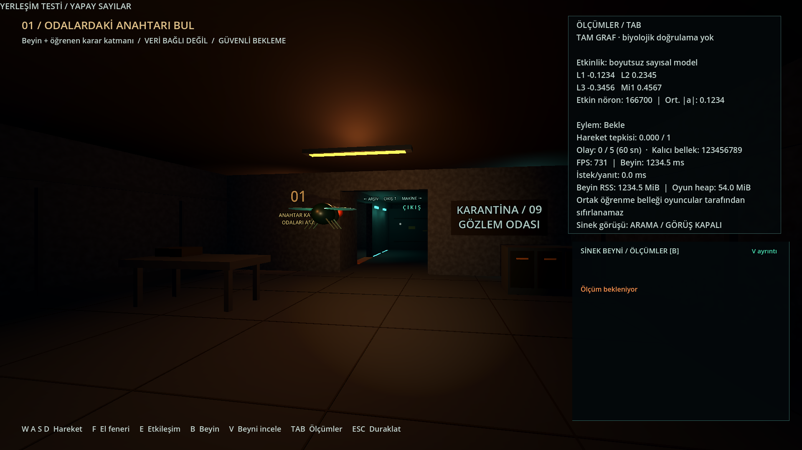

# TAB paneli yerleşim düzeltmesi — 11 Eylül 2026

Uzun sunucu mesajı, Label'ın asgari genişliğini büyüterek paneli ekran
dışına taşıyordu. Tanısal örnekte panel x=1360'ta **562 px** genişledi ve
1920 px ekranın sağından çıktı. Yerleşik akıllı kelime kaydırmasıyla
genişlik **510 px** kaldı. FPS önündeki boş satır kaldırılarak panelin
alt beyin görünümüyle çakışması da engellendi. Yazı boyutu, ölçülen değerler
ve durum mesajının içeriği değiştirilmedi.

Son panel sınırı: `(1360, 38)`, boyut `(510, 523)`; alt kenarı 561,
beyin görünümünün başlangıcı 580. Metin alanı 470 px genişliğinde.

`tests/hud.gd`, uzun bir gerçek hata mesajını ve büyük tanısal sayıları
üretim arayüzünden geçirir. Ekrana sığma, alttaki görünümle çakışmama,
görünür/toplam satır eşitliği ve bütün değerlerin korunması denetlenir.
Test `test.sh` içine eklendi; kişisel ayar veya öğrenme dosyası kullanılmaz.

- Yeni HUD kontrolü headless, görünür 1920×1080 pencere ve oyunun
  `toggle_fullscreen()` yolu üzerinden gerçek tam ekranda geçti.
- Mevcut **112 oynanış** ve **24 beyin görünümü** kontrolü geçti.
- Son testlerde script hatası, başarısız kontrol veya kapanış uyarısı yoktu.
- Semgrep: 17 Python/kaynak hedefinde 200 kural, **0 bulgu**.
- Web dışa aktarımı başarılı; HTTPS'den alınan oyun paketinin SHA256'sı
  yerel doğrulanmış paketle aynı. Canlı TAB paneli ayrı test sekmesinde
  gerçek sinir ölçümleriyle görüntülendi. Beyin hizmetinin süreç kimliği
  değişmedi; açık oyunlar ve ortak bellek korunarak yalnızca statik sürüm yenilendi.

Görüntülerdeki büyük nöron/sayaç/gecikme sayıları **yerleşim testi için
yapaydır**; biyolojik sonuç veya performans ölçümü değildir. Tam ekran
testi mevcut oyunun menüdeki geçişini sınar; kayıtlı tam ekran tercihiyle
soğuk açılış bu küçük düzeltmenin test kapsamına eklenmedi.

