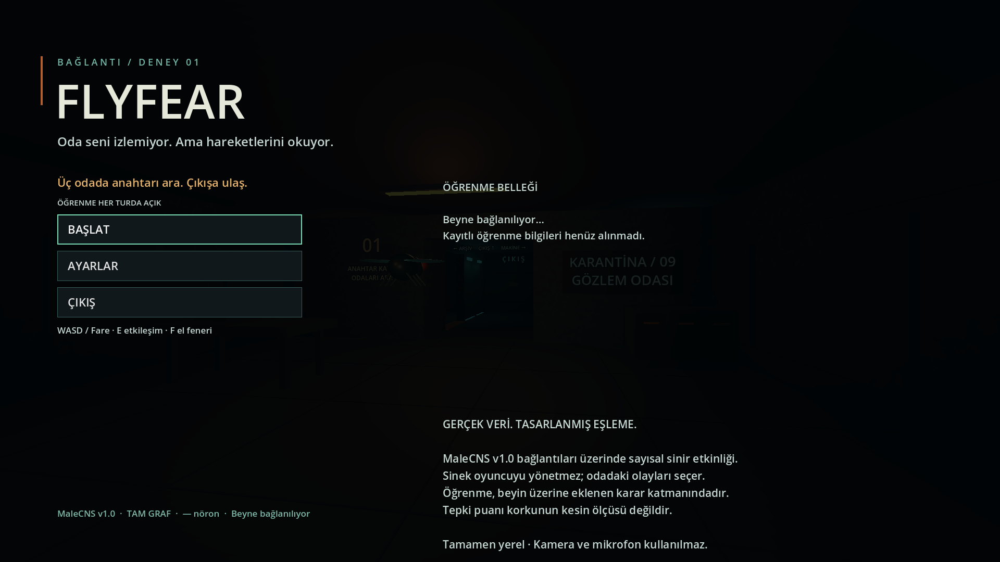

# TAB paneli yerleşim düzeltmesi — 11 Eylül 2026

Uzun sunucu mesajı, Label'ın asgari genişliğini büyüterek paneli ekran
dışına taşıyordu. Tanısal örnekte panel x=1360'ta **562 px** genişledi ve
1920 px ekranın sağından çıktı. Yerleşik akıllı kelime kaydırmasıyla
genişlik **510 px** kaldı. FPS önündeki boş satır kaldırılarak panelin
alt beyin görünümüyle çakışması da engellendi. Yazı boyutu, ölçülen değerler
ve durum mesajının içeriği değiştirilmedi.

Son panel sınırı: `(1360, 38)`, boyut `(510, 523)`; alt kenarı 561,
beyin görünümünün başlangıcı 580. Metin alanı 470 px genişliğinde.

`tests/hud.gd`, uzun bir gerçek hata mesajını ve büyük tanısal sayıları
üretim arayüzünden geçirir. Ekrana sığma, alttaki görünümle çakışmama,
görünür/toplam satır eşitliği ve bütün değerlerin korunması denetlenir.
Test `test.sh` içine eklendi; kişisel ayar veya öğrenme dosyası kullanılmaz.

- Yeni HUD kontrolü headless, görünür 1920×1080 pencere ve oyunun
  `toggle_fullscreen()` yolu üzerinden gerçek tam ekranda geçti.
- Mevcut **112 oynanış** ve **24 beyin görünümü** kontrolü geçti.
- Son testlerde script hatası, başarısız kontrol veya kapanış uyarısı yoktu.
- Semgrep: 17 Python/kaynak hedefinde 200 kural, **0 bulgu**.
- Web dışa aktarımı başarılı; HTTPS'den alınan oyun paketinin SHA256'sı
  yerel doğrulanmış paketle aynı. Canlı TAB paneli ayrı test sekmesinde
  gerçek sinir ölçümleriyle görüntülendi. Beyin hizmetinin süreç kimliği
  değişmedi; açık oyunlar ve ortak bellek korunarak yalnızca statik sürüm yenilendi.

Görüntülerdeki büyük nöron/sayaç/gecikme sayıları **yerleşim testi için
yapaydır**; biyolojik sonuç veya performans ölçümü değildir. İlk tam ekran
testi menüdeki geçişi sınadı; kayıtlı tercihle doğrudan açılış aşağıda
ayrı iki süreçle doğrulandı.


## Kayıtlı tam ekran tercihiyle doğrudan açılış

11 Eylül 2026 · Godot 4.5.2 · macOS ARM64 / M4 Pro

İlk görünür süreç, geçici bir ayar dosyasıyla başlayıp üretim menüsünün
`toggle_fullscreen()` yolunu kullandı. İkinci, bağımsız Godot süreci aynı
dosyayı `_ready()` sırasında okuyup doğrudan tam ekran açıldı. İkinci
süreçte test, tam ekrana geçişi ayrıca çağırmadı. Her iki süreç 0 koduyla
kapandı. Oyun kodunda hata yeniden üretilemedi ve üretim kodu değiştirilmedi.

Mevcut `tests/hud.gd` içine isteğe bağlı `--saved-fullscreen-check=<dosya>`
eklendi. İlk çalıştırma tercihi kaydeder, dosya varsa sonraki çalıştırma
başlangıçta yüklenen tam ekran ve sessiz ayarı sınar. Kaydın gerçekten diske
yazılması, yeniden açılışta baytlarının korunması, native pencere modu,
görünür menü etiketlerinin ekrana sığması ve satırlarının kesilmemesi
kontrol edilir. Mevcut öğrenme durumu ve HUD sınır kontrolleri de çalışır.

- İki görünür süreçte **3'er kontrol**, headless HUD'da **2 kontrol** geçti.
- İlgili mevcut **17 ayar kontrolü** geçti. Bozuk dosya ve başarısız yedekleme
  örneklerinin beklenen iki hata kaydı dışında script hatası veya uyarı yoktu.
- Doğrudan tam ekran açılışının menü ve HUD görüntüleri ayrıca incelendi;
  yazılar eksiksizdi. HUD yine `(1360,38) / (510,523)` sınırındaydı.
- Geçici ayar dosyası ve sessiz `Dummy` ses sürücüsü kullanıldı. Beyin
  istemcisinin işlenmesi durduruldu; kişisel ayarlar, öğrenme belleği ve
  canlı sunucu testlere katılmadı. Paneldeki sayılar yalnızca tanısaldır.

Tekrar çalıştırmak için, proje kökünden grafik oturumunda:

```sh
check_dir="$(mktemp -d "${TMPDIR:-/tmp}/flyfear-fullscreen.XXXXXX")"
for stage in save reopen; do
  ./tools/Godot.app/Contents/MacOS/Godot --audio-driver Dummy --path game \
    --script ../tests/hud.gd -- --saved-fullscreen-check="$check_dir/settings.cfg" || break
done
```

İlk çalıştırmada `Fullscreen preference saved`, ikincide
`Saved fullscreen cold start` sonucu beklenir. Menü ve HUD PNG'leri geçici
ayar dosyasının yanına yazılır. Standart `./test.sh` grafik pencere açmadan
mevcut headless HUD kontrollerini çalıştırmaya devam eder.

Semgrep güvenlik/gizli bilgi taraması: 43 hedefte 131 kural, **0 bulgu**;
hata veya uyarı yok. GDScript davranışı yukarıdaki Godot testleriyle doğrulandı.


