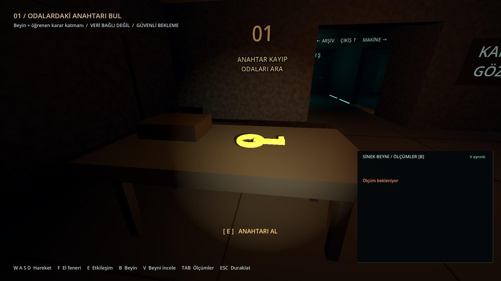
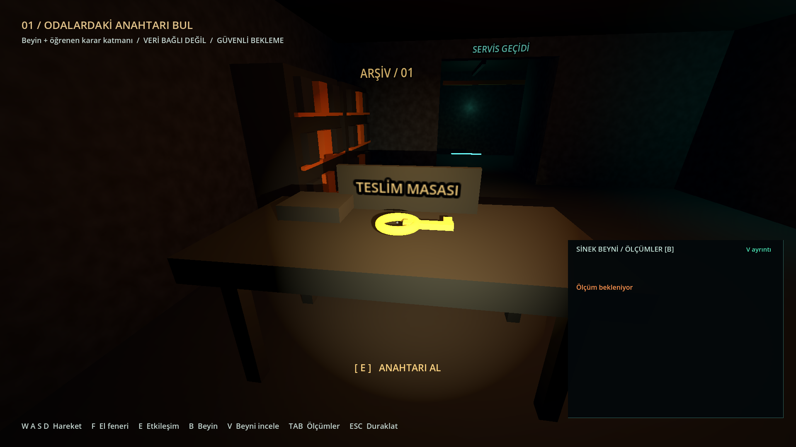
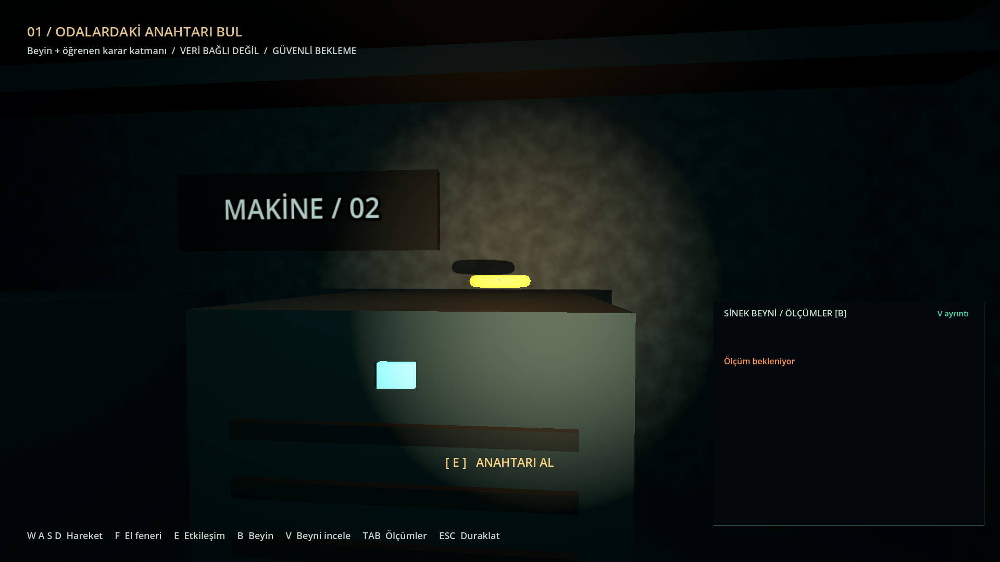

# Üç odada değişken anahtar araması

10 Eylül 2026 · macOS ARM64 · Godot 4.5.2

Anahtar, yeni tur başlarken gözlem odasındaki masa, arşivdeki teslim masası
veya makine odasındaki dolabın üstüne yerleşir. Aynı tohumla devam eden
oturumda bir önceki konum tekrar seçilmez. Yerleşimler gerçek geometride
önceden belirlenmiştir; duvar içi veya erişilemez rastgele koordinat üretilmez.

Tohum aynı konum dizisini yeniden üretir. Uygulama yeniden açıldığında veya
farklı tohumla yeni tur başlatıldığında dizi sıfırdan başlar; yerleşim dizisinin
ilerlemesi diske kaydedilmez. Duraklama/devam, alınmış anahtar ve konumu korur.
Korku seslerinin rastgele sayı akışı ayrıdır. Anahtarın küçük ışığı seçilen
konuma taşınır ve anahtar alındığında gizlenir. Menü, hedef yazısı, kilitli
kapı uyarısı ve oda tabelaları yeni arama biçimini anlatır.

## Doğrulama

- 11 Python/sunucu, 15 ayar, 24 beyin görünümü kontrolü geçti.
- 112 ses/oynanış kontrolü hem headless hem gerçek çizimli 1920×1080
  Godot sürecinde geçti. Bunların 67'si yeni anahtar araması içindir.
- İki kez 12 turluk aynı tohum dizisi karşılaştırıldı; üç konumun da seçildiği
  ve ardışık konumların farklı olduğu doğrulandı.
- Üç konumun her birine gerçek `CharacterBody3D` fiziğiyle yüründü; zeminde
  duruş, engelsiz etkileşim ışını, E tuşu yolu, ışığın taşınması/sönmesi,
  toplamadan önce/sonra devam ve yeni turdaki kapı kilidi sınandı.
- Her konumdan geri yürünüp kapı anahtarla açıldı ve zafer alanına girildi.
  Oyuncu bu rotalarda hedefe ışınlanmadı.
- Tam MaleCNS beyniyle headless tam turda 48 kontrol geçti; olaylar,
  duraklama, bağlantı kesilmesi/yenilenmesi ve tur kaydı birlikte sınandı.

[Headless ses/oynanış günlüğü](key-search-tests.log) ·
[Görünür ses/oynanış günlüğü](key-search-rendered-tests.log) ·
[Python, ayar ve beyin görünümü testleri](key-search-regression.log) ·
[Gerçek beyinle tam tur](game-smoke.json)

Tekrar çalıştırma:

```sh
./test.sh
./tools/Godot.app/Contents/MacOS/Godot --path game --script ../tests/gameplay.gd
./run.sh --benchmark --mode=learn
```

## Gerçek beyinle 1080p ölçümü

Öğrenen modda gerçek çizimli 1920×1080 turda **48 kontrol geçti**.
Ortalama **118.71 FPS**, p99 kare süresi **13.34 ms**;
büyük beyin görünümü **113.25 FPS** ölçüldü. Oyun tepe RSS
**397.0 MiB**, beyin tepe RSS **362.4 MiB**.
Bu kısa otomatik turun ölçümüdür; uzun oturum veya başka donanım garantisi değildir.

[Öğrenen mod ölçümü](game-learn-benchmark.json) · [Süreç belleği](runtime-learn.json)

Semgrep güvenlik ve gizli bilgi taraması uygulama kaynaklarında 0 bulgu ile
tamamlandı. GDScript davranışı yukarıdaki Godot kontrolleriyle sınandı.

## Görünür konum kontrolleri

Bu üç görüntüde beyin sunucusu kapalı olan izole oynanış testi kullanıldı;
panel bu nedenle “ölçüm bekleniyor” yazar. Gerçek beyinle entegrasyon ayrı tam
tur testinde doğrulandı. Kişisel ayarlar ve öğrenme belleği testlerde kullanılmaz.

### Gözlem odası



### Arşiv



### Makine odası


