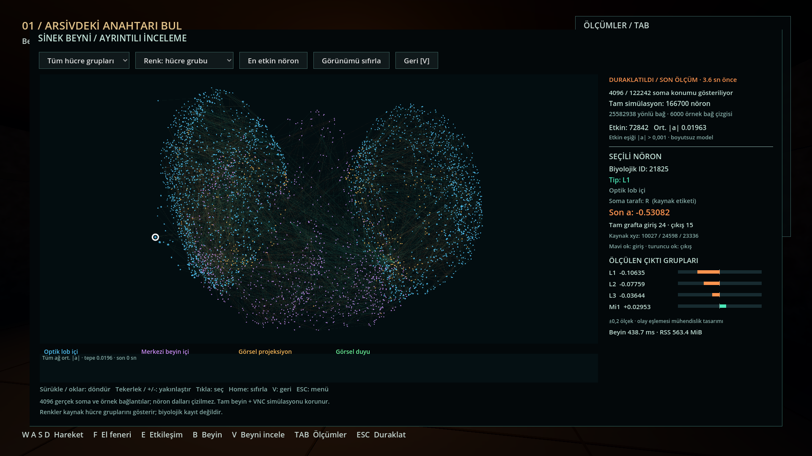
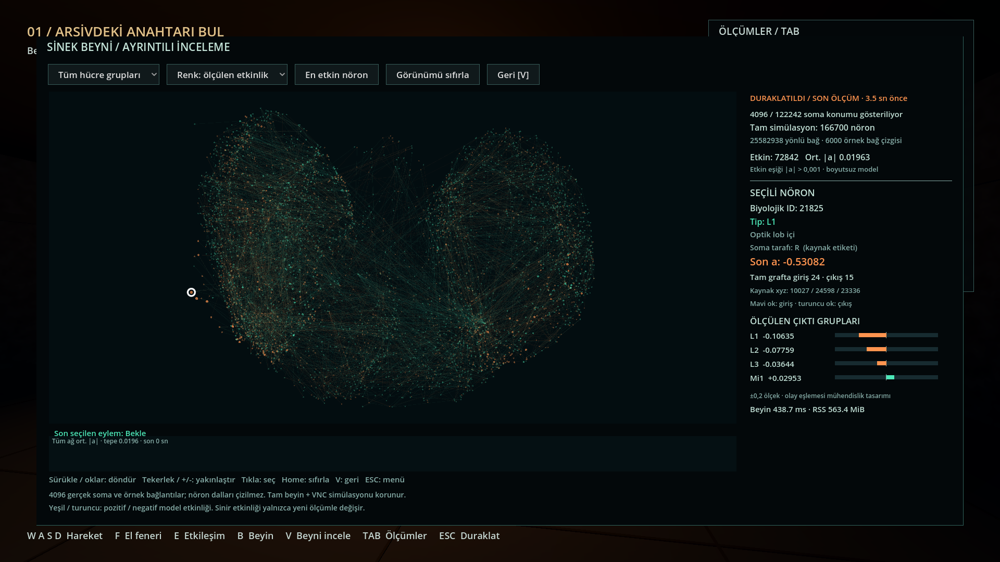

# Ayrıntılı beyin görünümü — 10 Eylül 2026

Beyin paneli **512 yerine 4.096 gerçek soma konumu** gösterir. Örnek içindeki
**6.000 gerçek işaretli bağlantı** taşınır; küçük panel bunların 1.000 çizgisini,
büyük görünüm filtre ve kadraja girenlerini çizer. V ile açılan büyük görünümde
fareyle sürükleme veya ok tuşlarıyla döndürme, tekerlek / +/- ile yakınlaştırma,
hücre grubu filtresi ve etkinlik / hücre grubu renk seçimi bulunur.

Nörona tıklayınca biyolojik ID, hücre tipi, kaynak sınıfı ve soma tarafı,
orijinal koordinat, tam graftaki giriş/çıkış bağlantı sayısı ve son model
etkinliği görünür. N tuşu görünür hücre grupları içindeki en yüksek ölçülen
mutlak etkinliği seçer; seçilen nöronun örnek bağlantıları yön oklarıyla
vurgulanır. Home görünümü sıfırlar. V önceki oyun durumuna, ESC duraklama
menüsüne döner. Küçük panel B ile açılıp kapanır.

## Verinin anlamı

Konumlar MaleCNS v1.0 `annotations.feather/somaLocation` alanından gelir.
Koordinatı bulunan dört beyin sınıfındaki 122.242 aday, biyolojik ID sırasından
deterministik örneklenir. Tek ortak ölçek kaynak eksen oranlarını korur;
döndürme gerçek üçüncü koordinatı da kullanır. Çizgiler örnek nöronlar arasındaki
gerçek model matrisinin en güçlü işaretli kenarlarıdır. Dallanmış nöron
morfolojisi veya zar yüzeyi çizilmez.

**166.700 nöron ve 25.582.938 yönlü bağlantıdan oluşan tam beyin + VNC grafiği
simüle edilmeye devam eder.** Bu değişiklik görsel örneklemeyi büyütür;
sinir dinamiğini, oyun olaylarını veya öğrenme algoritmasını değiştirmez.
Girdi/çıktı eşlemesi ve etkinlik dinamiği mühendislik tasarımıdır.
[Veri kaynakları](../../README.md#doğrulanan-özgün-kaynaklar--sürümler) ve
[lisanslar](../../README.md#sınırlar-ve-lisans).

V ile inceleme oyunu ve beyin kararlarını duraklatır; ekranda kalan değerler
yaşı belirtilen **son ölçümdür**. Renkler model etkinliğini veya kaynak hücre
gruplarını gösterir; biyolojik kayıt değildir. Yeni ölçümler arasında sahte
ateşleme üretilmez. Bağlantı kaybı, gecikme ve duraklama ayrı etiketlenir.
Grafik son 32 gerçek örneğin zamanlarını kullanır; yeni turda temizlenir.

## Doğrulama

- [Tam test çalıştırması](tests.log): 11 Python/sunucu testi, 15 ayar,
  42 ses/oynanış ve ilk 20 beyin görünümü kontrolü geçti. Ayar testindeki iki
  ERROR, kasıtlı bozuk dosya ve yedekleme hatasının beklenen çıktılarıdır.
- [Son beyin görünümü testi](viewer-tests.log): **21/21** geçti. Fare hareketi
  olayları birleştiğinde sürüklemenin yanlışlıkla tıklamaya dönüşmesini önleyen
  kontrol de eklendi. Döndürme, yakınlaştırma, seçim, filtre, duraklama/devam,
  eski ölçüm, yeni tur temizliği ve geçersiz veri sınırları sınandı.
- Gerçek kaynak ID/koordinat/tip/taraf/bağlantı derecesi, eksen oranları ve
  6.000 kenarın kaynak matrisiyle eşleşmesi Python testinde doğrulandı.
- Gerçek tam modelle **46/46 tam tur kontrolü**, hem [headless](game-smoke.json)
  hem [görünür 1080p](game-learn-benchmark.json) çalıştırmada geçti. Büyük
  panelin duraklatıp geri dönmesi, 4.096 ölçümün istemciye ulaşması,
  bağlantı kesintisi ve anahtarla çıkışın tamamlanması kapsanır.
- Native macOS penceresinde gerçek fare sürüklemesi ve tekerlek girdisi
  ayrıca denendi: yaw 0,18 → 1,86, pitch −0,12 → 0,488 ve zoom 1 → 1,12.
  [Girdi çıktısı](manual-input.log).
- [Semgrep](semgrep.log): 9 Python hedefinde 187 kural, **0 bulgu**;
  GDScript kontrolleri Godot ile yapıldı. Yeni bağımlılık eklenmedi.

## Görünür performans

Apple M4 Pro, 24 GB birleşik bellek, Godot 4.5.2 Compatibility,
1920×1080, öğrenen mod, tek gerçek tam beyin süreci ve açık ölçüm panelleri.

| Ölçüm | Sonuç |
|---|---:|
| Oyun ortalama FPS | 115,88 |
| Oyun ölçülen kare sayısı | 6.921 |
| Oyun kare aralığı p99 | 13,553 ms |
| Aktif tur süresi | 61,72 sn |
| Büyük beyin görünümü ortalama FPS | 108,57 |
| Büyük görünüm ölçülen kare sayısı | 228 |
| Oyun en yüksek RSS | 396,7 MiB |
| Beyin en yüksek RSS | 563,6 MiB |

[Kare ölçümleri](game-learn-benchmark.json) · [Bellek izi](runtime-learn.json).
Büyük görünüm ölçümü yaklaşık 2,1 saniyelik kısa bir örnektir; aktif oyun
ölçümü yaklaşık bir dakikalık otomatik rotadır. Uzun insan oturumu veya
her açı/zoom için sabit FPS garantisi değildir. Headless FPS, grafik
performansı kanıtı olarak kullanılmaz.

İlk yoğun çizimde tek tek daire/çizgi komutları oyun FPS'sini 27,94'e,
büyük görünümü 23,49'a düşürdü. Godot'un
[MultiMesh](https://docs.godotengine.org/en/4.5/classes/class_multimesh.html)
özelliğiyle noktaları ve `draw_multiline_colors` ile çizgileri toplu çizmek,
aynı 4.096 nokta / 6.000 bağlantı sınırında bu sorunu giderdi. Yukarıdaki
ölçüm toplu çizim sürümüne aittir. Sonraki değişiklikler ölçümdeki eylemi
duraklatırken koruma ve fare sürüklemesiyle sınırlıdır; çizim yöntemi aynıdır.

Testler ayrı doğrulama oturumlarında çalıştırıldı; kişisel ayarlar veya
öğrenilmiş kullanıcı parametreleri yüklenmedi. Kayıtlardaki yerel kullanıcı
yolları temizlendi. Tekrar çalıştırma: proje kökünde `./test.sh`, ardından
`./run.sh --benchmark --mode=learn`.

## Oyun içinden görüntüler

