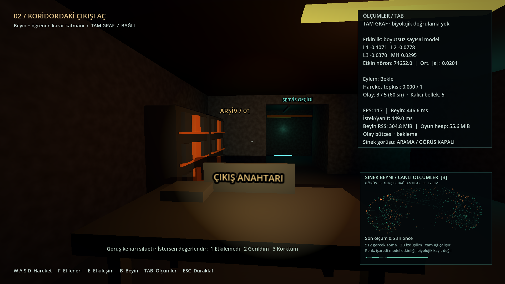
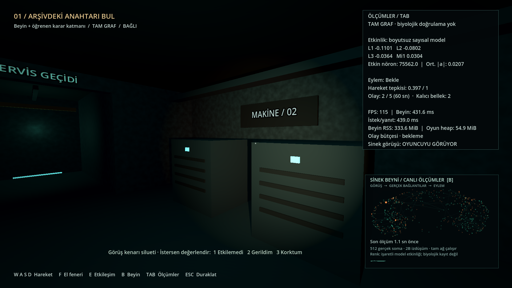
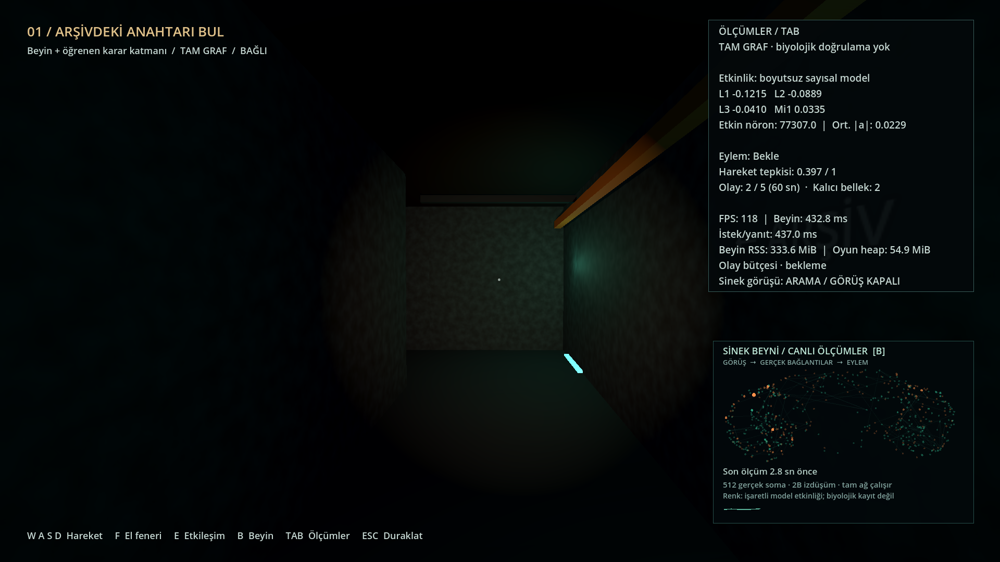

# Genişletilmiş harita — 10 Eylül 2026

Gözlem odasına **arşiv**, **makine odası** ve iki yan odayı arkadan bağlayan
**servis koridoru** eklendi. Raflar, dosyalar, masa tabelası, jeneratör
kabinleri, havalandırma yarıkları ve kablo kanalları özgün temel geometriden
oluşturuldu. Ana koridorun yan kapıları 2,4 metre genişliğinde; odaların
aydınlatması ışık olayına katılıyor, acil yön ışıkları açık kalıyor.

Anahtar artık arşiv masasındadır. En kısa rota: gözlem odası → ana koridor →
sol kapı / arşiv → anahtar (E) → ana koridor → çıkış (E). Makine odası →
arka servis geçidi → arşiv, keşfedilebilen ikinci yoldur. Zafer koşulu çıkış
kapısının hemen arkasındaki alana sınırlandı; yan odalar ve servis koridoru
oyunu yanlışlıkla bitiremez. Arka geçit ile çıkış arasında katı duvar vardır.

El fenerinin Metal/Compatibility renderer'daki çizgili gölge hatası,
kapalı geometrinin arka yüzünden gölge üretimiyle giderildi. Gölge ve
çarpışmalar çalışmaya devam eder. Yeni paket veya ücretli varlık eklenmedi.

## Doğrulama

- **11 Python/sunucu testi + 15 ayar kontrolü + 42 ses/oynanış kontrolü** geçti.
  [Tam çıktı](tests.log). Ayar testindeki iki ERROR, kasıtlı bozuk dosya ve
  yedekleme hatasıdır; önceki dosyanın korunduğu ayrıca doğrulanır.
- **43 tam tur kontrolü**, hem [headless](game-smoke.json) hem
  [görünür 1920×1080](game-learn-benchmark.json) oyunda geçti.
  Gerçek WASD/fizik, makine odası → servis geçidi → arşiv rotası, anahtar,
  korku olayları, duraklama, bağlantı kaybı/yeniden bağlantı, kapı ve zafer
  kaydı sınandı. [Görünür oyun çıktısı](rendered.log).
- Dört yeni kapıdan sineğin sığması, dış duvarların oyuncuyu ve sineği tutması,
  arka koridordan çıkışın aşılamaması ve üç farklı servis konumunda yanlış
  zafer tetiklenmemesi regresyon kontrolünde sınandı.
- Semgrep, Python ve secret kurallarıyla taradığı 9 dosyada **0 bulgu** verdi;
  GDScript davranış doğrulaması Godot testleriyle yapıldı. [Tarama](semgrep.log).

## Görünür performans

Apple M4 Pro, 24 GB birleşik bellek, Godot 4.5.2 Compatibility, 1920×1080;
öğrenen mod, gerçek tam MaleCNS grafiği, tek beyin süreci ve açık ölçüm paneli.

| Ölçüm | Sonuç |
|---|---:|
| Ortalama FPS | 115.58 |
| Kare aralığı p99 | 14.035 ms |
| Aktif tur süresi | 61.6 sn |
| Oyun en yüksek RSS | 346.6 MiB |
| Beyin en yüksek RSS | 334.2 MiB |
| Tam tur kontrolü | 43 / 43 |

[Kare ölçümleri](game-learn-benchmark.json) · [Bellek izi](runtime-learn.json).
Bu kısa otomatik rota 60 FPS hedefini karşılıyor; uzun insan oturumu ölçümü
değildir. Kişisel ayar/öğrenme dosyaları testlere yüklenmedi. Bağlantı modeli,
öğrenme parametre biçimi ve duyusal normalizasyon değiştirilmedi; daha büyük
haritanın insan korkusu veya öğrenme başarımına etkisi bu çalışmada ölçülmedi.
Sineğin bütün haritayı planlı biçimde takip ettiği iddia edilmez; mevcut görüş,
çarpışma ve sinir çıktısıyla yönelme denetimi kullanılır.

## Oyun görüntüleri

Tekrar çalıştırma: proje kökünde `./test.sh`, ardından
`./run.sh --benchmark --mode=learn`. Görünür rota güncel ekran görüntülerini
ve ölçümü `reports/` altına yazar; bu klasör bu sürümün arşivlenmiş kanıtıdır.
