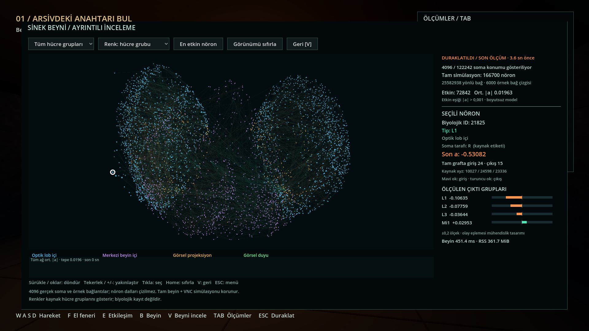

# Genel performans optimizasyonu — 10 Eylül 2026

Beyin açılışı, bellek kullanımı, oyun arayüzünün CPU yükü ve sinir ölçümü
mesajları optimize edildi. Karşılaştırmanın başlangıcı `4eba87e` sürümüdür.
166.700 nöron, 25.582.938 yönlü bağlantı, 24 sayısal iterasyon ve öğrenme
algoritması korunur. Görünüm yine 4.096 gerçek soma ve 6.000 örnek bağlantı
taşır; çözünürlük, ışıklar, gölgeler veya sahne ayrıntıları azaltılmadı.

## Ölçülen sonuçlar

Apple M4 Pro, 24 GB birleşik bellek; Python 3.12.12, NumPy 2.2.6,
SciPy 1.15.3, Arrow 20.0.0, Godot 4.5.2 Compatibility. Beyin tek süreçte,
CPU üzerinde çalıştı. Başlatma ölçümleri üç ayrı süreç çiftinin medyanıdır;
işletim sistemi dosya önbelleği sıcaktır. Önce ve sonra aynı makinede,
birbiriyle çakışmayan çalıştırmalar kullanıldı.

| Ölçüm | Önce | Sonra | Değişim |
|---|---:|---:|---:|
| Beyin modelini yükleme | 0,856 sn | 0,415 sn | %51,6 daha kısa |
| Başlatma / ilk adım tepe RSS | 591,8 MiB | 358,5 MiB | %39,4 daha az |
| İlk adım sonrası RSS | 559,0 MiB | 358,5 MiB | %35,9 daha az |
| Küçük beyin paneli çizim hazırlığı, 7 sn toplam CPU | 343,97 ms | 17,49 ms | %94,9 daha az |
| Duraklatılmış büyük panel, 3 sn toplam CPU | 220,40 ms | 6,62 ms | %97,0 daha az |
| Aynı 4.096 ölçümün JSON boyutu | 90.731 bayt | 32.216 bayt | %64,5 daha küçük |
| 1080p oyun ortalama FPS | 114,76 | 118,68 | %3,4 artış |
| Büyük görünüm ortalama FPS | 106,25 | 113,44 | %6,8 artış |
| Oyun kare aralığı p99 | 13,409 ms | 13,202 ms | Küçük fark |

[Ölçüm özeti ve ham başlangıç tekrarları](metrics.json) ·
[Son görünür oyun ölçümü](game-benchmark.json) · [Süreç bellek izi](runtime.json).

Görünür oyun karşılaştırması yaklaşık 61,7 saniyelik aynı otomatik rota,
öğrenen mod ve açık ölçüm panelleriyle yapıldı. Son çalıştırmada 7.083 oyun
karesi, büyük görünümde 238 kare ölçüldü. Büyük görünüm bölümü yaklaşık
2,1 saniyedir. FPS, pencere sunumu ve ekran yenilemesinden de etkilenir;
CPU hazırlığındaki %95 azalma, bütün oyunun %95 hızlandığı anlamına gelmez.
Uzun insan oturumu veya bütün kamera açıları için sabit FPS garantisi yoktur.

## Değişiklikler

**Anatomi yükleme:** Arrow tablosu içinde hücre sınıfı ve soma konumu
filtrelenir; NumPy ile biyolojik ID eşleşmesi yapılır. Yalnızca gösterilecek
4.096 kayıt Python listelerine dönüştürülür. Önceki yol 211.577 kaydın
tamamını Python nesnelerine çeviriyordu. Mevcut
[Arrow `filter` / `take` işlemleri](https://arrow.apache.org/docs/20.0/python/generated/pyarrow.Table.html)
kullanıldı. Çıkış bağlantı derecesi sayımında `bincount` için bütün indeks
dizisini int64'e kopyalamak yerine
[`np.add.at`](https://numpy.org/doc/2.2/reference/generated/numpy.ufunc.at.html)
ile mevcut int32 indeksler üzerinden sayım yapılır.

**Ağ çizimi:** nöron ve bağlantı çizimi ayrı bir native `Control` içinde
tutulur. Godot'un [saklanan çizim komutları](https://docs.godotengine.org/en/4.5/tutorials/2d/custom_drawing_in_2d.html#updating)
kullanılır; yeni ölçüm, dönüş/zoom, filtre, renk, seçim veya canlı/eski durum
değiştiğinde yenilenir. Yaş etiketi gibi metinler 10 Hz güncellenir. Yedi
saniyelik canlı örnekte ağır ağ çizimi 67 yerine 2 kez hazırlandı;
duraklatılmış üç saniyede 28 yerine 0 kez. Görsel dönüş ve seçim girdileri
doğrudan yenileme ister, ölçüm aralığını beklemez.

**HUD:** oyun ve menü metinleri her kare yerine 10 Hz hazırlanır. Görünmeyen
öğrenme özeti ve ölçüm paneli yazıları oluşturulmaz. Hareket, fizik, olay
süreleri, etkileşim eylemi ve telemetri hazırlığı bu sınırlamanın önünde
çalışır. Ekrandaki yardım metninin yenilenmesi en fazla yaklaşık 0,1 saniye
bekleyebilir; E tuşuyla etkileşim mevcut konum ve görüşü doğrudan denetler.

**Mesajlar ve kayıtlar:** JSON ayırıcılarındaki gereksiz boşluklar kaldırıldı.
Görsel etkinlik örnekleri zaten beş ondalık basamağa yuvarlanıyordu;
float32 → Python float dönüşümünden kalan uzun sayı kuyrukları da temizlendi.
Karşılaştırılan örnekte bu sunum farkı en fazla `1,41e-8` oldu. Tam nöron
durumu ve karar katmanına giden değerler bu yuvarlamayı kullanmaz.

Yeni bağımlılık, ayrı önbellek paketi veya yeni model biçimi eklenmedi.

## Doğrulama ve kapsam

- [Tam test](tests.log): **11 Python/sunucu**, **15 ayar**, **45 ses/oynanış**
  ve **24 beyin görünümü** kontrolü geçti. Ayar testindeki iki ERROR,
  kasıtlı bozuk dosya ve başarısız yedekleme senaryolarının beklenen çıktısıdır.
- **46/46 tam tur kontrolü** hem [headless](game-smoke.json) hem görünür
  çalıştırmada geçti: gerçek sinir çıktısı, olay bütçesi, duraklama,
  bağlantı kesintisi/yeniden bağlanma, anahtar, çıkış ve zafer kaydı.
- [Native görünüm kontrolü](viewer-rendered.log): **24/24** geçti. Yeni
  kontroller, yaş etiketi güncellenirken ağ çiziminin saklanmasını ve yeni
  ölçüm/renk değişiminde yeniden çizilmesini gerçek draw sinyaliyle sınar.
- Eski ve yeni sürümde **16 ardışık adımın 166.700 elemanlı float32 durum
  dizileri bit düzeyinde aynı** çıktı. Üç başlangıç çiftinde de tüm görünüm
  metadatasının SHA256 değeri ve ilk tam nöron durumu eşleşti. Kaynak
  koordinatları, biyolojik ID'ler, tipler, kenarlar ve dereceler ayrıca
  mevcut veri testlerinden geçti. Tam nöron dizisi karşılaştırması,
  sunum için kısaltılan JSON sayı metninden bağımsızdır.
- [Semgrep](semgrep.log): `brain`, `game`, `tools`, `tests` uygulama/test
  yollarındaki taramada 0 bulgu; GDScript davranışı ayrıca Godot testlerinde
  doğrulandı. [Kaynak arşivini de içeren tarama](semgrep-source-archive.log),
  değiştirilmeyen `research/build_kernel.py` DOOMFLY kopyasında bir subprocess
  bulgusu verdi. Bu dosya FLYFEAR tarafından çağrılmaz; incelenen derleme
  çağrısı sabit çalıştırılabilir dosyayı argüman listesiyle, `shell=False`
  varsayılanında çalıştırır. Bu bulgu uygulama değişikliklerine ait değildir;
  araştırma arşivinin tarama sonucu yukarıdaki ayrı çıktıda korunur.

CPU hazırlık süreleri, gerçek Godot penceresinde üretim metotlarını çağıran
geçici ölçüm alt sınıflarında `Time.get_ticks_usec()` ile toplandı. İlk
5 saniye dışarıda bırakıldı; 7 saniye oyun ve 3 saniye duraklatılmış inceleme
ölçüldü. Son sürümde metin ve ağ süreleri birlikte toplanarak eski tek
`_draw()` ölçümüyle karşılaştırıldı. Bunlar GPU süreleri değildir.

Python profili, karar süresinin yaklaşık %98,7'sinin SciPy CSR matris-vektör
çarpımında geçtiğini gösterdi. Denenen CSC biçimi bu makinede daha yavaştı;
uygulanmadı. Beyin karar hesaplamasının belirgin biçimde hızlandığı iddia
edilmez; bu bölümdeki kazanım yükleme ve bellektedir.

Testler kişisel ayar ve öğrenme dosyalarını yüklemeyen ayrı oturumlarda
çalıştırıldı. Yerel kullanıcı yolları paylaşılan çıktılardan temizlendi.
Temel doğrulama için `./test.sh`; görünür rota için
`./run.sh --benchmark --mode=learn`; native görünüm için
`./tools/Godot.app/Contents/MacOS/Godot --path game --script ../tests/brain_view.gd`.

