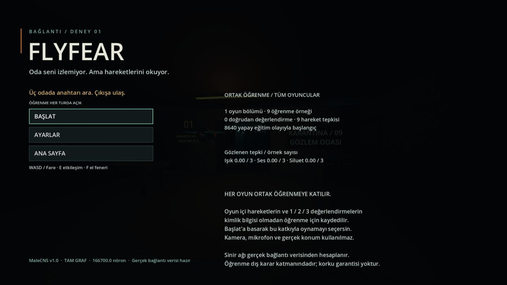
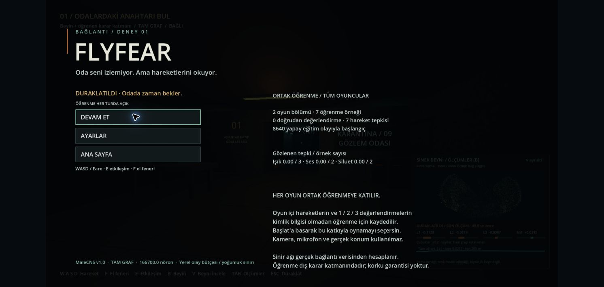
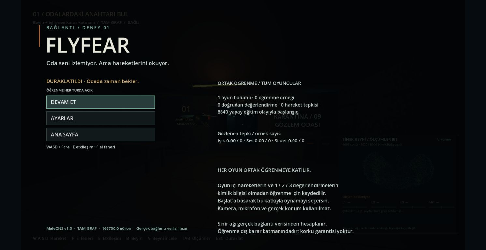
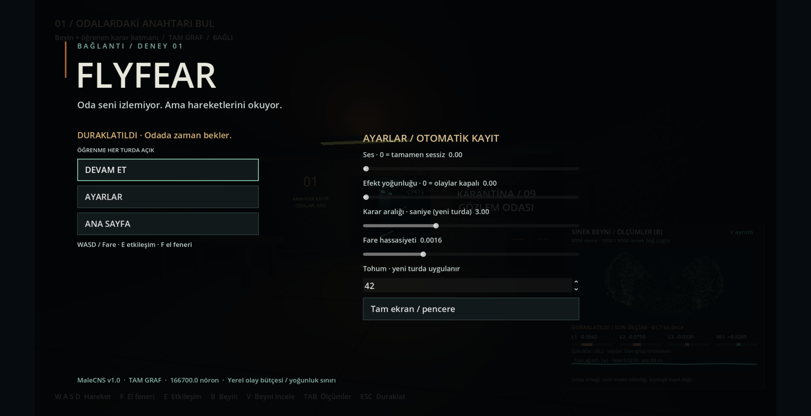

# Web yayını doğrulaması — 10 Eylül 2026

[FLYFEAR'ı oyna](https://furkancakir.dev/flyfear/).

Mevcut Godot 4.5.2 oyunu HTTPS sayfasında açıldı; 166.700 nöronluk tam
MaleCNS ağı sunucuda çalıştı. Normal masaüstü ve web oyunları öğrenen
karar katmanına zorunlu olarak bağlanır. Kontrol modları araştırma testlerine ayrıldı.

## Kontroller

- **12 Python/sunucu testi:** gerçek veri, üretim istemcisinin zaman aşımı,
  yerel iletişim ve iki eşzamanlı public istemci geçti.
- **17 ayar, 112 ses/oynanış/anahtar, 24 beyin görünümü ve 48 tam tur
  kontrolü** geçti. Son ayar testi eski sabit mod tercihinin normal oyunu
  öğrenmeden çıkaramadığını da doğrular. Testler kişisel kayıtlardan ayrıdır.
- [Tam tur kontrol listesi](game-checks.json): gerçek fizik rotası,
  anahtar alma, kilitli çıkış, nöron görünümü ve kesinti/devam.
- WebGL oyunu canlı adreste açıldı. Tarayıcı klavye olaylarıyla ileri
  hareketin oyun telemetrisinde **3,2 birim/sn** ürettiği ve oyuncunun
  koridora ilerleyip katı duvarda durduğu görüldü. ESC menüsü ve devam çalıştı.
- Canlı WSS yanıtlarında **4.096 gerçek nöron örneği** alındı. Işık,
  ses ve siluet kararları; hareket ödülleri ve doğrudan `3` değerlendirmesi
  sunucu belleğine ulaştı. Web denemesi için kamera/mikrofon açılmadı.
- Canlı hizmet yeniden başlatıldı: **9 öğrenme örneği** korunurken
  model dosyasının baytları değişmedi. Yeniden bağlantı ve yeni web
  oturumu aynı ortak öğrenmeyi görür. Otomatik public testinde bu durum
  iki istemcinin doğrudan değerlendirmeleriyle de doğrulanır.
- Sağlık yolu HTTPS 200 döndürdü; ana sitenin HTTP 200 yanıtı korundu.
  COOP/COEP, WASM MIME ve kamera/mikrofon/konum izin kısıtları kontrol edildi.
  Deneme hizmeti kapatıldı; kalıcı hizmet otomatik başlatmaya alındı.

[Semgrep güvenlik taraması](semgrep.log): 17 dosyada 200 kural, **0 bulgu**. Paylaşılacak dosyalarda özel sunucu adresleri, SSH anahtarları ve yerel kişisel kayıtlar bulunmadığı kontrol edildi.

## Ölçümün kapsamı

Tarayıcıda görülen anlık kare hızı yaklaşık **119–120 FPS**; tek oyunculu
sinir hesabı yaklaşık **0,68–0,74 saniye**, gözlenen tam istek/yanıt
yaklaşık **0,78–0,82 saniye** oldu. Bunlar bu test makinesi ve bağlantısının
anlık gözlemleridir; 1920×1080 çizim yüzeyi 1280×720 tarayıcı görünümünde izlendi; bütün cihazlar veya sekiz oyuncu için garanti değildir.
Sekiz bağlı oyuncu sınırı yapılandırılmıştır; eşzamanlı durum/öğrenme
doğrulaması iki istemciyle yapılmıştır.

Web üzerinde Godot heap sayacı sıfır döndürdüğü için bunu gerçek bellek
ölçümü gibi sunmak yerine “Web: ölçülmüyor” yazılır. Başlat/duraklat
menüsündeki açıklama alt kenara sığdırıldı. Ses mekanikleri yerel
karışım testleriyle doğrulandı; son web testlerinde kullanıcının isteğiyle
Mac'in sistem sesi kapalı tutuldu. Safari ve dokunmatik kontrol test edilmedi.

Öğrenme, gerçek bağlantılardan hesaplanan sinir çıktıları üzerindeki dış
karar katmanındadır. Her geçerli tepki bu modeli günceller; her güncellemenin
bir insanı daha fazla korkutacağı veya biyolojik öğrenme olduğu iddia edilmez.

Tarayıcı konsolunda Godot/Emscripten ana iş parçacığı uyarısı ve pointer-lock geçişlerinde Chromium `UnknownError` kayıtları görüldü. Bu oturumda açılış, hareket, ölçüm, duraklatma ve devam kontrollerini engellemediler; konsolun tamamen hatasız olduğu iddia edilmez.




## Sekme görünürlüğü ve iptal edilen tepki — 11 Eylül 2026

Üretim web paketi, ayrı geçici öğrenme klasörü kullanan gerçek MaleCNS
sunucusuna localhost üzerinden bağlandı. Chrome'da görünürlük durumu
[DevTools odak emülasyonu](https://chromedevtools.github.io/devtools-protocol/tot/Emulation/#method-setFocusEmulationEnabled)
açılıp kapatılarak kontrollü değiştirildi; `document.hidden` ve
`document.visibilityState` değerleri doğrudan okundu. Mac kilitliydi;
fiziksel sekme tıklamasıyla insan kullanım denemesi yapılmadı.

- Uygulanan `steps` olayı için geri bildirim penceresi açıldıktan **18,04 ms**
  sonra gizlenen sayfa `pause` gönderdi. Bu tek denemenin ölçümüdür.
- Duraklama sonrasındaki **105,40 saniyelik** gözlemde yeni hareket,
  karar, uygulama veya ödül mesajı görülmedi. Hizmetin 90 saniyelik boş
  bağlantı sınırı bu gözlemin içinde kaldı; kesintisiz bağlantı iddiası yoktur.
- Görünürlük geri geldiğinde menü **DURAKLATILDI / DEVAM ET** olarak kaldı.
  Kullanıcı işlemiyle yeniden bağlantı kurulunca tur `paused: true` ile
  açıldı; ayrıca DEVAM ET'e basıldıktan sonra karar akışı başladı.
- İptal edilen olay ödül almadı. İzole denemenin sayacı **7 → 7** kaldı;
  model dosyasının baytları değişmedi. Bu sayılar test oturumuna aittir.
- Hata yeniden üretilemedi; oyun ve sunucu üretim kodu değiştirilmedi.

`tests/test_public.py` içindeki mevcut gerçek sunucu testine şu regresyon
kontrolü eklendi: uygulanmış olay → duraklatma → dururken kararın reddi →
dururken ve devamdan hemen sonra eski değerlendirmenin reddi → 23 yeni
hareket örneğinde eski pencereye ödül yazılmaması → model dosyasının korunması.
Bu test, ortak öğrenme ve yeniden başlatma kontrolleriyle birlikte geçti.
Mevcut **112 oynanış kontrolü** de geçti. Semgrep: 43 hedefte 131 kural,
**0 bulgu**, hata veya uyarı yok.

```sh
.venv/bin/python -m unittest tests.test_public -v
./tools/Godot.app/Contents/MacOS/Godot --headless --path game --script ../tests/gameplay.gd
```

[Ölçüm özeti ve test edilen paket SHA256'sı](visibility-check.json).
Kişisel ayarlar ve canlı ortak bellek kullanılmadı. Test sekmeleri ve geçici
sunucu kapatıldı. Web yayınına dosya yüklenmedi.




## Yeniden bağlantı menüsü düzeltmesi — 11 Eylül 2026

Bağlantı yokken BAŞLAT veya DEVAM ET'e basılması menü başlığını kalıcı
bir bağlantı mesajıyla değiştiriyordu. Beyin hazır olunca alt durum satırı
güncelleniyor, üstte ise eski “Beyne bağlanılıyor… Hazır olunca Başlat'a bas”
yazısı kalıyordu. Duraklatılmış turda düğme DEVAM ET olduğu için yönlendirme
de yanlıştı.

Başlık artık mevcut 10 Hz arayüz güncellemesinde oyun durumundan üretilir:
ilk açılışta anahtar arama hedefi, duraklamada DURAKLATILDI, bitişte çıkış
sonucu. Bağlantının güncel durumu mevcut alt satırda ve öğrenme alanında
kalır. Başlığı farklı yerlerden değiştiren beş atama kaldırıldı.
Bağlanma, başlatma ve devam etme koşulları değişmedi.

- Mevcut HUD testine üç oyun durumu × iki bağlantı durumu kontrolü eklendi.
  Tanısal eski başlık, güncel durum gösterilmeden önce bilerek yerleştirilir.
  Kontrol eski kodda başarısız oldu; düzeltmeden sonra geçti. Başlık,
  bağlantı durum satırı ve oyunun kendiliğinden başlamaması birlikte sınanır.
- **3 HUD, 17 ayar ve 112 oynanış kontrolü** geçti. Ayar testinin beklenen
  bozuk dosya/yedekleme kayıtları dışında script hatası veya uyarı yoktu.
- Yeni web paketi, ayrı öğrenme klasörlü gerçek yerel beyinle Chrome'da
  sınandı. İlk açılışta beyin durduruldu, BAŞLAT denendi, beyin açıldı:
  hedef başlığı korundu ve oyun başlamadı. Gerçek tur duraklatılıp bağlantı
  tekrar kesildi; DEVAM ET denendi ve beyin açıldı. Başlık DURAKLATILDI,
  düğme DEVAM ET, alt satır “Gerçek bağlantı verisi hazır” olarak kaldı.
- Yeniden bağlantı mesajında `paused: true` görüldü. Kontrol boyunca
  otomatik `resume`, karar, uygulama veya ödül mesajı oluşmadı. İzole
  öğrenme sayacı sıfır kaldı. Kişisel ve canlı ortak bellek test edilmedi.
- Semgrep: 43 hedefte 131 kural, **0 bulgu**, hata veya uyarı yok.

Web dışa aktarımı tamamlandı ve yalnızca statik dosyalar yayımlandı.
Beyin hizmetinin süreç kimliği değişmedi. HTTPS'den alınan paket ile
sınanan yerel paketin SHA256'sı aynı:
`7d65c04a78e8a186c2c85c6a3410e08e448ec78579e8a69fcd446676f3dca32f`.
Canlı açılış menüsü, oyun başlatılmadan doğrulandı. Geçici test süreçleri
ve sekmeler kapatıldı.




## Web ayarlarının kalıcılığı — 11 Eylül 2026

Değiştirilmemiş üretim web paketi, ayrı localhost origininde gerçek MaleCNS
sunucusuna bağlandı. Öğrenme için geçici klasör kullanıldı. Ses **0**, efekt
yoğunluğu **0**, fare hassasiyeti **0,0016** olarak menüden kaydedildi.
Sayfa yenilendikten sonra aynı değerler hem menüde hem tarayıcının IndexedDB
ayar dosyasında doğrulandı.

- Yenileme sonrası **170,59 saniyelik** gerçek turda beyin 2 ışık, 2 ses ve
  52 siluet olayı seçti. İstemci 56 olayın tamamına `accepted: false` yanıtı
  verdi. Ödül oluşmadı; turdan sonra yeni bağlantıyla okunan öğrenme sayacı
  **0** kaldı. Bu, sıfır yoğunluğun yeniden açılan oyuna uygulandığını doğrular.
- Mevcut ayar testine kayıtlı fare hassasiyeti için bir kontrol eklendi:
  üretim girdi işleyicisine verilen 100 × 50 piksellik hareket, yatayda
  −0,16 ve dikeyde −0,08 radyan dönüş üretti. **18 grafik Godot kontrolü**
  geçti. **17 headless kontrolü** de geçti; headless ekran fareyi
  yakalayamadığından bu ilave girdi kontrolü orada açıkça atlanır.
- Aynı test, yeniden açılışta ana ses kanalının çalma öncesinde sessize
  alındığını doğruladı. Bozuk dosya/yedekleme testlerinin iki beklenen hata
  kaydı dışında script hatası veya uyarı yoktu.
- Mac kilitli olduğundan Chrome pointer lock isteğini reddetti. Tarayıcıda
  fiziksel fare dönüşü sınanamadı; Godot kontrolü verilen bir girdi olayıyla
  yapıldı. Sistem sesi kapalı kaldı; bu turda dinleme veya tarayıcı ses
  örneği ölçümü yapılmadı.
- Hata yeniden üretilemedi; üretim kodu ve web yayını değiştirilmedi.
  Kişisel ayarlar ve canlı ortak öğrenme kullanılmadı. Test sekmesi ve
  geçici sunucu kapatıldı.

Semgrep'in üretim/test kapsamı (`brain`, Python araçları/testleri, `game`,
`web`) 44 hedefte 216 kuralla tamamlandı: **0 bulgu**, hata veya uyarı yok.
GDScript mantığını yukarıdaki Godot kontrolleri sınar. Ayrıca tüm depo
tarandığında arşivlenmiş DOOMFLY kaynağı `research/build_kernel.py:13` için
bir subprocess uyarısı çıktı. Çağrı incelendi: sabit `clang++` komutu argüman
listesiyle ve varsayılan `shell=False` ile çalışır; kullanıcı çıktıyı bir dosya
yolu olarak seçer. Kabuk komutu birleştirilmediğinden bu çağrıda belirtilen
kabuk enjeksiyonu yolu doğrulanmadı. Araştırma kopyası oyun çalışma yolunda
kullanılmaz; değiştirilmedi. Bütün depo için sıfır bulgu iddiası yoktur.

```sh
./tools/Godot.app/Contents/MacOS/Godot --headless --path game --script ../tests/settings.gd
./tools/Godot.app/Contents/MacOS/Godot --path game --audio-driver Dummy --script ../tests/settings.gd
```

[Ölçüm özeti ve paket SHA256'sı](settings-check.json).




## Tarayıcı ses çıkışı — 11 Eylül 2026

Üretim menüsünün ortam sesi, ayrı localhost origininde ve geçici gerçek
MaleCNS sunucusuyla ölçüldü. Oyun turu başlatılmadı; sunucu yalnızca ilk
bağlantı bilgilerini gönderdi, tur ve öğrenme sayıları sıfır kaldı.

Geçici test HTML'ine, Godot yüklenmeden önce bir ölçüm betiği eklendi.
`AudioDestinationNode` hedefine bağlanan `GainNode` ve `AudioWorkletNode`
çıkışlarının her birine ek bir
[AnalyserNode ölçüm dalı](https://developer.mozilla.org/en-US/docs/Web/API/AnalyserNode)
bağlandı; özgün ses bağlantıları korundu. Oyun paketi, WASM ve Godot
JavaScript dosyası değiştirilmedi. Her aşamada çıkış başına 40 pencere ×
2.048 mono örnek alındı; örnekleme hızı 48 kHz, pencere aralığı yaklaşık
50 ms, gözlem süresi yaklaşık 2,04 saniyeydi. Bu, sürekli stereo kayıt değildir.

| Menü ses düzeyi | Ortam sesinin RMS değeri | Tepe değer | Diğer çıkış RMS |
| --- | ---: | ---: | ---: |
| 0,45 | 0,005007 | 0,008601 | 0 |
| 0 | 0 | 0 | 0 |
| Yeniden 0,45 | 0,004381 | 0,008093 | 0 |
| 0 kaydedilip sayfa yenilendi | 0 | 0 | 0 |

Tüm aşamalarda ses bağlamı `running` durumundaydı ve ses saati yaklaşık
2,04 saniye ilerledi. Böylece sıfır örneklerin askıya alınmış ses bağlamından
kaynaklanmadığı kontrol edildi. Sıfır düzeyindeki iki aşamada, iki çıkıştan
alınan örneklerin tamamı sıfırdı. Farklı anlarda alınan pozitif RMS değerleri
fiziksel ses yüksekliği ölçümü değildir.

[Ham sayısal ölçüm özeti ve paket SHA256'sı](audio-check.json).
Mac'in sistem sesi kapalı kaldı; dinleme, mikrofon veya kişisel ses kaydı
yapılmadı. Bu kontrol Chrome'daki menü ortam sesini kapsar; her konumsal
korku klibi veya başka tarayıcılar için aynı sonucu garanti etmez.

Üretim kodunda hata çıkmadı; değişiklik ve yeniden yayın gerekmedi.
Mevcut **112 ses/oynanış kontrolü** geçti. Semgrep'in üretim/test kapsamı
44 hedefte 216 kuralla tamamlandı: **0 bulgu**, hata veya uyarı yok.
Geçici test sekmesi ve sunucu kapatıldı.


## Kaybolan tuş bırakma olayı — 11 Eylül 2026

Oyun sırasında W basıldıktan sonra sayfa gizlendiğinde duraklatma çalışıyordu.
Ancak W'nin bırakılma olayı sayfaya ulaşmazsa Godot'un fiziksel tuş durumu
basılı kalıyordu. Açık DEVAM ET işleminden sonra oyuncu kendiliğinden
yürümeye devam ediyordu. Bu, ayrı localhost originindeki üretim web
paketinde kontrollü olarak yeniden üretildi.

Ortak `pause_game()` yolu artık W/A/S/D için
[Godot'un yerleşik girdi işleme yöntemine](https://docs.godotengine.org/en/4.5/classes/class_input.html#class-input-method-parse-input-event)
bırakma olayları gönderir. ESC, pencere/sekme odak kaybı, bağlantı kesintisi
ve ayrıntılı beyin paneli aynı duraklatma yolundan geçer. Yeni bağımlılık
veya ayrı bir tuş durumu sistemi eklenmedi.

| Devam sonrası ölçüm | Önce | Sonra |
| --- | ---: | ---: |
| Gözlenen telemetri örneği | 10 | 10 |
| İlk ve son örnek arasındaki süre | 0,933 sn | 0,918 sn |
| En yüksek hız | 3,2 birim/sn | 0 |
| İstenmeyen yatay yer değiştirme | 2,987 birim | 0 |

Her iki denemede tuş basımından yaklaşık 419 ms sonra sayfa gizlendi.
Tuş bırakma olayı gönderilmedi; görünürlük geri gelince menü açık kaldı.
Duraklama ile açık devam arasında yeni hareket/karar/ödül mesajı oluşmadı.
Düzeltmeden sonra verilen yeni W basımı yine **3,2 birim/sn** hareket üretti.

Mevcut `tests/gameplay.gd` kontrolü, basılı fiziksel tuş durumunu oluşturur,
tuş bırakma göndermeden duraklatıp devam eder ve oyuncunun yatay konumunun
korunduğunu doğrular. Ardından yeni basımın hareket ürettiğini kontrol eder.
Test eski oyun kodunda başarısız oldu; düzeltmeden sonra geçti. Girdi
oluşturulurken Godot'un olay tamponu boşaltılır; böylece basılı tuşun
gerçekten kaydedildiği önkoşulu kontrol edilir.

**114 oynanış, 17 ayar, 3 HUD ve 24 beyin görünümü kontrolü** geçti.
Ayar testindeki iki beklenen bozuk dosya/yedekleme hatası dışında hata veya
uyarı yoktu. Semgrep üretim/test taraması: 44 hedef, 216 kural, **0 bulgu**;
hata veya uyarı yok.

[Önce/sonra ölçümleri ve paket SHA256'ları](focus-input-check.json).
Web denemesinde tuş basımı sentetik bir DOM `KeyboardEvent` idi; görünürlük
`Emulation.setFocusEmulationEnabled` ile değiştirilip `document.hidden`
üzerinden doğrulandı. Fiziksel klavye veya elle sekme değiştirme denemesi
yapılmadı. Menü zaten açıkken basılan tuşlar bu turun kapsamı dışındadır.
Ses ve efekt yoğunluğu sıfırdı; geçici gerçek MaleCNS sunucusunun öğrenme
sayacı sıfır kaldı. Kişisel ve canlı ortak öğrenme testlerde kullanılmadı.

Düzeltilmiş statik web paketi yayımlandı; HTTPS'den alınan paket özeti
sınanan yerel paketle eşleşti. Beyin hizmetinin süreç kimliği değişmedi,
ortak öğrenme hizmeti yeniden başlatılmadı. Canlı menü oyun başlatılmadan
açıldı; önceden belgelenen Emscripten ana iş parçacığı uyarısı sürüyordu,
yeni bir GDScript yükleme hatası görülmedi. Geçici sekmeler ve yerel test
sunucusu kapatıldı; önceki web sürümü sunucuda korundu.


## Menüden oyuna geçerken bekleyen tuşlar — 11 Eylül 2026

Önceki kontrolün dışında kalan iki durum da aynı gün ayrı olarak sınandı:
ilk menü açıkken W basılması ve duraklatılmış menü açıkken W basılması.
Her ikisinde de sayfa gizlendi, tuş bırakma olayı gönderilmedi ve görünürlük
geri geldikten sonra kullanıcı işlemiyle BAŞLAT / DEVAM ET seçildi.
Önceki paket iki durumda da oyuncuyu yeni hareket girdisi olmadan yürüttü.

Tuş temizliği `pause_game()` içinden mevcut `player.reset_motion()` işlevine
taşındı; devam yolu da artık bu işlevi çağırır. Başlangıç, duraklatma ve
devam aynı temizliği kullanır. Godot'un olay tamponu sıfırlama sırasında
boşaltılır; fizik işleme sırasından bağımsız olarak eski tuş durumu hareket
başlamadan temizlenir. Yeni bir durum sistemi veya yardımcı sınıf eklenmedi.

| Menüden giriş | Önceki istenmeyen yer değiştirme | Düzeltmeden sonra |
| --- | ---: | ---: |
| İlk tur | 2,72 birim | 0 |
| Devam edilen tur | 3,09 birim | 0 |

Yer değiştirmeler, her denemedeki ilk ve son telemetri örneği arasındadır;
örnekler yaklaşık 0,85–0,96 saniyelik aralığı kapsar. Önceki pakette iki
durumda da hız **3,2 birim/sn** idi. Yeni pakette bütün örnekler başlangıç
konumunda, sıfır hızla kaldı. Sonradan gönderilen yeni W basımı yine
**3,2 birim/sn** hareket üretti.

Mevcut oynanış testine yeni tur ve devam için aynı senaryoyu çalıştıran
kısa bir döngü eklendi. Her aşama önce basılı tuş önkoşulunu, ardından
hareketsizliği ve yeni girdinin çalışmasını doğrular. İki kontrol eski
oyun kodunda başarısız oldu; düzeltmeden sonra geçti. **118 oynanış,
17 ayar, 3 HUD ve 24 beyin görünümü kontrolü** başarılı. Önceki aktif oyun
duraklatma kontrolü de geçmeye devam ediyor. Beklenen iki bozuk ayar dosyası
hatası dışında hata veya uyarı yok. Semgrep üretim/test kapsamı: 44 hedef,
216 kural, **0 bulgu**, hata veya uyarı yok.

[Ölçümlerin `menu_activation` bölümü ve paket özetleri](focus-input-check.json).
Web ölçümü ayrı localhost origininde, geçici gerçek MaleCNS sunucusuyla
yapıldı. Ses ve efekt yoğunluğu sıfırdı; öğrenme sayacı sıfır kaldı.
Sentetik DOM tuş girdisi ve Chrome görünürlük emülasyonu kullanıldı;
fiziksel klavye/elle sekme geçişi veya farklı tarayıcılar sınanmadı.

Yeni statik paket yayımlandı; HTTPS paket özeti ölçülen yerel sürümle
eşleşti. Beyin hizmeti yeniden başlatılmadı ve süreç kimliği değişmedi.
Geçici test sunucusu ve sekmesi kapatıldı; kişisel ayarlar ve canlı ortak
öğrenme testlerde kullanılmadı.


## Sinir hesabı sırasında bağlantı kesintisi — 11 Eylül 2026

Mevcut `tests/test_public.py` kontrolü, iki gerçek WebSocket istemcisinden
birinin hesaplama sırasında aniden kopmasını da sınar. Ayrı localhost
sunucusu tam **166.700 nöronluk MaleCNS** grafiğini kullanır; bütün öğrenme
ve tur kayıtları geçici bir klasördedir.

Yalnızca test sürecinde bir gerçek matris çarpımı tamamlandıktan sonra,
sinir adımı geri dönmeden hesaplama iş parçacığı kontrollü bekletilir.
Test, bu noktaya gelindiğini gördükten sonra ilk istemcinin TCP taşımasını
aniden kapatır. Bekletme ancak ikinci istemci gerçek kararını ve olay
onayını aldıktan sonra kaldırılır; zamanlamaya bağlı bir kesinti tahmini
yapılmaz. Sinir çıktıları veya sunucunun karar/ödül işlevleri taklit edilmez.

- Son çalışmada kalan istemcinin istek/yanıt süresi **414,20 ms** oldu;
  üretim web istemcisinin **5 saniyelik** sınırı içinde kaldı.
- On iki sinir okuması bağımsız, sıfırlanmış modelle `1e-7` mutlak
  toleransta; gösterilen nöron etkinlikleri birebir eşleşti.
- İlk turun kesinti kaydı tamamlandıktan sonra yeni ziyaretçi bağlandı
  ve beklenen ortak bellek özetini aldı.
- İlk istemcinin uygulanmamış kararı ve ikinci istemcinin olay onayından
  sonra yarım kalan tepki penceresi **0 yeni ödül** üretti. İki tur da
  `connection_lost` ile kapandı; uygulanmış olay sayıları sırasıyla 0 ve 1.
  Önceki iki test ödülü korundu; model dosyasının baytları değişmedi ve
  yeniden başlatılan sunucu aynı modeli yükledi.
- Kontrolü sınamak için ayrı bir denemede yalnızca test sunucusunun
  hesaplama kapasitesi 2'den 1'e düşürüldü. Kalan istemci tam bu kontrolün
  5 saniyelik sınırında zaman aşımına uğradı; beklenen başarısızlık yakalandı.

**12 Python/sunucu testi** geçti (37,47 sn). Olay onayını geciktirmemek için
test sırası netleştirildikten sonra public kontrolü yeniden geçti (15,80 sn).
Semgrep: 44 hedef, 216 kural, **0 bulgu**; hata veya uyarı yok.

```sh
OPENBLAS_NUM_THREADS=1 OMP_NUM_THREADS=1 .venv/bin/python -m unittest discover -s tests -v
OPENBLAS_NUM_THREADS=1 OMP_NUM_THREADS=1 .venv/bin/python -m unittest tests.test_public -v
```

Üretim hatası bulunmadı; oyun/sunucu kodu değişmedi ve canlı hizmete dağıtım
yapılmadı. Bu, kontrollü yerel bağlantı kesintisi doğrulamasıdır; internet
gecikmesi, tarayıcı arayüzü veya sekiz eşzamanlı oyuncu için yük testi değildir.
Geçici sunucular kapandı; kişisel ve canlı ortak bellek kullanılmadı.


## Öğrenme kaydı hatasında belleğin geri alınması — 11 Eylül 2026

Model dosyası yazılamadığında eski dosya zaten korunuyordu, ancak öğrenme
güncellemesi RAM'de geri alınmıyordu. Sonuç: başarılı ödül yanıtı gitmemesine
rağmen kapanan turun `end_updates` alanı diskteki **2** yerine **3** diyordu.
Bu, kaydedilmemiş bir örneğin öğrenme ölçümünde sayılmasıydı.

Sunucudaki küçük ortak kayıt işlevi, karar katmanının durumunu değişiklikten
önce kopyalar; güncelleme/kayıt başarısız olursa aynı nesnenin eski durumunu
geri yükler ve hatayı mevcut hata yönetimine iletir. Oturumların ortak
karar nesnesine referansları korunur. Yeni ödül, önceki ödülün düzeltilmesi
ve yerel araştırma modundaki sıfırlama bu işlevi kullanır. Biyolojik bağlantı
matrisi kopyalanmaz; yeni bağımlılık eklenmedi.

Mevcut public entegrasyon testinde, iki geçerli test ödülünden sonra yeni
bir gerçek sinir kararı alınır ve olay uygulanır. Yalnızca geçici kayıt
klasöründe modelin `.tmp` dosyası yoluna bir klasör konur. Sonraki doğrudan
değerlendirme gerçek bir dosya sistemi yazma hatası üretir.

| Kontrol | Önce | Sonra |
| --- | --- | --- |
| Asıl model dosyasının baytları | Korunuyor | Korunuyor |
| Başarılı ödül / değerlendirme yanıtı | Gönderilmiyor | Gönderilmiyor |
| Hatalı oturumun son öğrenme sayacı | **3 — yanlış** | **2 — kayıtlı değer** |
| Hatalı istemci / diğer istemci kapanışı | 1011 / 1001 | 1011 / 1001 |
| Yeniden açılışta öğrenme | 2 geçerli örnek | 2 geçerli örnek |

Sayaç kontrolü eski üretim kodunda `3 != 2` ile başarısız oldu. Düzeltmeden
sonra **12 Python/sunucu testi 40,62 saniyede geçti**; gerçek Godot istemcisi,
iki public oturum, bağlantı kesintisi, başarılı ödül düzeltme ve sıfırlama
kontrolleri de bu dizide bulunur. Hata olan turda ödül/geri bildirim kaydı
oluşmadı; yalnızca sıfır ödüllü tur kapanışı yazıldı. Semgrep: 44 hedef,
216 kural, **0 bulgu**, hata veya uyarı yok.

```sh
OPENBLAS_NUM_THREADS=1 OMP_NUM_THREADS=1 .venv/bin/python -m unittest discover -s tests -v
```

Canlı sunucu bağlı oyuncu yokken güncellendi; önceki kod yedeklendi ve yeni
dosyanın özeti doğrulandı. Yeniden başlatma boyunca ortak model ve tur
dosyalarının baytları değişmedi; **11 öğrenme / 2 tur** korundu. HTTPS sağlık
kontrolü ve gerçek WSS `hello` yanıtı hazır durumu doğruladı; kontrol için
oyun turu başlatılmadı. Statik oyun paketi değişmedi.

Yazma hatası yalnızca geçici yerel sunucuda oluşturuldu. Bu deneme geçici
dosyanın açılamamasını sınar; fiziksel disk arızası veya güç kesintisi testi
değildir. Kişisel kayıtlar kullanılmadı, canlı belleğe test ödülü yazılmadı.


## Mobil web — 11 Eylül 2026

Sol alandaki dokunmatik çubuk hareketi, sağ alandaki sürükleme bakışı
yönetir. Etkileşim, fener, duraklatma, beyin görünümü ve üç değerlendirme
ekrandadır. Menü/ayarlar doğal Godot kaydırma alanını, oyun düğmeleri
çoklu dokunmayı destekleyen TouchScreenButton kullanır. Ekran dönüşü,
odak kaybı ve dokunma iptali hareketi temizler; devam açık kullanıcı girdisi
gerektirir. Masaüstü klavye/fare düzeni korunur. Yeni bağımlılık eklenmedi.

Web paketi mobil uyumluluk için tek iş parçacıklı şablona ve mobil/masaüstü
doku biçimlerine geçirildi. Mobil çizim tamponu 1,5× ile sınırlı, arayüz
CSS piksel boyutundadır. Yeniden boyutlandırma sırasında eski pencere
boyutunun kullanılması web'de görüntüyü sıkıştırıyordu; boyut sinyali
ertelenerek gerçek yatay/dikey geçiş düzeltildi.

- `./test.sh`: **12 Python testi (40,66 sn), 189 Godot kontrolü** başarılı.
  Bunların 27'si mobil düzene/girdilere ait: dört ekran boyutu, aynı anda
  iki parmak, üçüncü parmakla fener, bırakma/iptal, yön değişimi, devam,
  değerlendirme ve gerçek fizik engeli olmayan anahtarı dokunarak alma.
- Chromium'da 320×568, 390×844, 568×320 ve 844×390 düzenleri incelendi.
  3× piksel yoğunluğunda 390×844 CSS / 585×1266 çizim tamponu doğrulandı.
  Masaüstü 1280×720 görünümü 1920×1080 oyun tuvalini korudu.
- Sentetik DOM dokunmalarıyla gerçek, ayrı 166.700 nöronlu test beynine
  hareket ve değerlendirme ulaştı. “Gerildim” kabul edildi; aynı olayın
  hareket ödülü 0,5 doğrudan puanla düzeltilirken örnek sayısı 3 kaldı.
- Yeni web şablonunda iki gerçek WebAudio çıkışından 81.920'şer örnek
  ölçüldü. Ses 0,45 iken ortam sesi var; sıfırda iki çıkış da sıfır.
  Ses saatleri ilerliyordu. Fiziksel dinleme yapılmadı.
- Semgrep uygulama kapsamı: **353 kural / 39 hedef / 0 bulgu**.
  WebSocket vekilinin Upgrade değeri sabit `websocket` yapıldı. Tüm
  Upgrade değerlerini eşleyen genel h2c kuralı bu güvenli sabit değerde
  de uyarı verdiği için gerekçeli, yalnızca o satıra ait istisna eklendi.
  İndirilen araştırma HTML'indeki canonical bağlantı uyarısı çalıştırılan
  uygulamaya ait değildir; araştırma arşivi uygulama taramasına alınmadı.

Statik paket **önce canlıya yayımlandı**. JS, WASM ve PCK dosyalarının
HTTPS SHA256 özetleri yerel paketle aynı. HTML kaynağı da aynı; CDN'nin
eklediği güvenlik betiği ayrıca tanındı. Canlı mobil menü hatasız açıldı;
kontrol için tur başlatılmadı. Nginx yapılandırması doğrulanıp nazikçe
yenilendi; önceden açık WSS bağlantısı ping/pong ile çalışmaya devam etti.
Beyin süreci yeniden başlamadı, öğrenme ve tur dosyalarının baytları
değişmedi. Sağlık yanıtı yayın kontrolünde 24 örnek / 4 tur gösteriyordu.

[Makine tarafından okunabilir sonuçlar](mobile-check.json). Tarayıcı
denemeleri emülasyon ve sentetik dokunma olaylarıdır; fiziksel iOS/Android,
Safari donanımı veya telefon FPS ölçümü değildir. Testler kişisel ve
canlı öğrenmeyi kullanmadı. Geçici test sunucuları ve tarayıcı kapandı.

### Uzun mobil hata metinleri — 11 Eylül 2026

Mevcut `tests/mobile.gd`, gerçek sunucu sıfırlama reddi ve uzun ayar
yedekleme hatasıyla genişletildi. 320×568, 390×844, 844×390 ve 568×320
boyutlarında iki mesaj × menü/ayarlar görünümü: **16 yeni durum** geçti.
Etiketlerin bütün satırları yerleşime sığıyor, etiketler düğmelerle
çakışmıyor ve kaydırma alanı ekranın yatay sınırında kalıyor. Her görünür
düğme ile durum satırı, yerleşik `ensure_control_visible` üzerinden
tamamen görülebilir alana getirilebiliyor.

Önceki test ilk boyuttan sonra oyuna geçtiği için sonraki menü kontrolleri
görünmeyen düğmeleri atlıyordu. Her boyutun başında mevcut duraklatma yolu
menüyü açar; yeni kontroller görünür etiket/düğme listesinin boş olmasını
da başarısız sayar. Toplam **43 mobil kontrol geçti**; hata/uyarı yok.
Geçici test kopyasında yalnızca durum etiketinin satır kaydırması
kapatıldığında 12 yeni kontrol ve üç mevcut genişlik kontrolü başarısız
oldu; geniş 844×390 görünüm metin sığdığı için geçti. Üretim kodu değişmedi.

```sh
./tools/Godot.app/Contents/MacOS/Godot --headless --path game --script ../tests/mobile.gd
```

Semgrep: bir dosyada **49 genel kural / 0 bulgu**, hata/uyarı yok.
Bu kontrol gerçek Godot yerleşimini headless çalıştırır; fiziksel
telefon, tarayıcı çizimi veya parmakla menü kaydırma denemesi değildir.
Mevcut dokunmatik hareket/değerlendirme kontrolleri de aynı çalışmada
geçti. Kişisel kayıtlar ve canlı öğrenme kullanılmadı.

Push öncesi canlı HTML'nin mevcut `game-01113e1eb9072136.pck` paketini
gösterdiği ve HTTPS paketinin SHA256 özetinin yerel yayınla eşleştiği
doğrulandı. Sağlık yanıtı hazır, 166.700 nöron / 27 öğrenme / 5 tur.
Oyun dosyaları değişmediğinden yeni dağıtım gerekmedi; canlı hizmete
ve açık oyunlara müdahale edilmedi.

### Mobil değerlendirme yerleşimi — 11 Eylül 2026

Mevcut mobil teste dört ekran boyutu × üç gerçek olay adı eklendi:
**12 yeni yerleşim durumu**, toplam **55 başarılı kontrol**. Kısa yatay
568×320 ve 844×390 ile dar dikey 320×568 ve 390×844 sınandı. Uzun
koridor hedefi açıkken ışık, ses ve siluet değerlendirmelerinin bütün
satırları görünür; üstbilgi ve puan hedefleriyle çakışma yok. Üç puan
hedefinin her biri 92×48 px, ekran içinde ve diğerlerinden ayrı.

Karşılaştırma etiketlerin boş yer ayıran sabit kutusunu değil, mevcut
font ve satır kaydırmanın hesapladığı metin yüksekliğini kullanır.
Geçici test kopyasında puan hedeflerini 44 px yukarı taşımak **12 yeni
kontrolün tamamını başarısız** kıldı; diğer 43 kontrol geçti. Gerçek
uygulamada sorun bulunmadı ve üretim kodu değiştirilmedi.

Kontrol `tests/mobile.gd` komutuyla headless Godot'ta çalıştı; bağlantı
ve değerlendirme durumu yalnızca yerleşim için testte oluşturuldu.
Ağ bağlantısı/öğrenme başlatılmadı; fiziksel telefon veya tarayıcı çizimi
sınanmadı. Mevcut dokunma, iptal, yön değişimi ve değerlendirme girdisi
kontrolleri de geçti. Semgrep: **49 genel kural / 0 bulgu**, hata/uyarı yok.

Push öncesi canlı HTML ve mevcut oyun paketinin HTTPS SHA256 eşleşmesi
doğrulandı; sağlık yanıtı hazır, 166.700 nöron / 27 öğrenme / 5 tur.
Üretim dosyaları değişmediği için yeni dağıtım gerekmedi; açık oyunlar
ve öğrenme kayıtları kullanılmadı.


## %100 yüklemede takılma — 2026-09-11

Sorun gerçek Chrome profilinde yeniden üretildi. `index.js` disk
önbelleğinden eski iş parçacıklı sürüm olarak geldi (`max-age=14400`);
WASM yeni tek iş parçacıklı sürümdü. JavaScript 358.024 karakter, yeni
dosya 305.185 bayttı. `godot_audio_worklet_start_no_threads` eksikliği
WASM başlatmasını durdurdu. İndirme göstergesi %100'de kaldı.

Dışa aktarıcı artık motor JS/WASM/ses dosyalarına ortak içerik özetli ad,
PCK'ya kendi içerik özetli ad verir. Godot'un `executable`, `mainPack` ve
`fileSizes` alanları birlikte güncellenir. Yeni HTML en son atomik yazılır;
eski sürümlü dosyalar açık yükleyiciler için korunur. Yalnızca PCK
değiştiğinde motorun adresi değişmez. Başlatma aşamasındaki yakalanmamış
WASM hatası, normal Promise reddi veya yüklenmeyen JS, görünür hata ve
yeniden deneme düğmesine ulaşır; indirme sonrası “Oyun açılıyor…” görünür.

- 13 Python testi geçti. Yeni regresyon: aynı içerikte sabit adres, PCK
  değişiminde sabit motor, ses modülü değişiminde yeni motor, eski
  dosyaların korunması ve eksik dışa aktarımda mevcut HTML'nin korunması.
- `node tests/web_loader.mjs`: altı açılış/hata/yeniden deneme senaryosu
  geçti. Bu kontrol Node standart modülleriyle sahte DOM/Engine kullanır.
- Gerçek Chrome'da WASM isteği bilerek engellendi: hata gösterildi;
  engel kaldırılıp yeniden deneme düğmesine basılınca menü açıldı.
- Yayından önce takılan aynı canlı Chrome sekmesi, önbelleği temizlemeden
  ve devre dışı bırakmadan normal yenilemeyle açıldı. Yeni JS/WASM/PCK
  adresleri HTTP 200 verdi; ikinci normal yenileme de başarılıydı.
- Canlı Chrome 390×844 / 3× mobil emülasyonunda menü açıldı; yerelde
  aynı pakette dokunarak tur başlatıldı ve oda/ekran kontrolleri çizildi.
  Yerel beyin ayrıydı; canlıda test turu başlatılmadı. Fiziksel telefon
  veya Safari doğrulaması değildir. Düzeltme sonrası canlı konsol hatası yok.
- Semgrep uygulama kapsamı: 353 kural / 39 dosya / 0 bulgu. Değişen
  yükleyici, dışa aktarıcı ve iki yeni test ayrıca açık dosya yollarıyla
  tarandı: 492 kural / 4 dosya / 0 bulgu; iki tarama da hatasız tamamlandı.
- `web-20260911-loading-cache` yayını önceki statik dosyaları koruyarak
  atomik etkinleştirildi. Beyin PID'si, öğrenme dosyaları ve açık WSS
  korundu; Nginx/beyin yeniden başlatılmadı. HTTPS'teki beş motor/paket
  dosyasının SHA256 değerleri ve uygulama yükleyicisi yerel çıktıyla
  eşleşti. Sağlık: hazır, öğrenme açık, 166.700 nöron, 24 örnek / 4 tur.

Ayrıntılı sonuç: [loading-cache-check.json](loading-cache-check.json).


## Olay onayında kimlik türü — 2026-09-11

Python'da `True == 1` ve `1.0 == 1` eşitliği, public `applied` mesajında
hatalı türdeki kimliğin bekleyen tamsayı olayını onaylamasına yol açıyordu.
İki ayrı bağlantıda `true` ve `1.0` gönderildiğinde eski koddan beklenmeyen
iki `feedback_open` geldi; yeni regresyon kontrolü 4,203 saniyede başarısız oldu.

Ortak sunucu onay yoluna `type(id) is int` kontrolü eklendi. Yanlış türdeki
onaylar bütçeye/tepki penceresine ulaşmadan yok sayılır. Test bu onayların
ardından yapılan değerlendirmenin reddedildiğini, öğrenme dosyasının
oluşmadığını ve aynı bekleyen kimliğe doğru tamsayı onayı verildiğinde
ikisinin de normal öğrenebildiğini doğrular. Toplam kayıt iki güncellemedir.

13 Python testi 39,958 saniyede geçti; buna gerçek Godot istemcisinin
onay/geri bildirim akışı da dahildir. Semgrep uygulama taraması 353 kural /
39 dosya, değişen sunucu ve public testinin açık yol taraması 321 kural /
2 dosya: iki taramada da 0 bulgu, hata ve uyarı yok.

İlk yayın kontrolünde bağlantı görüldüğü için hizmet değiştirilmedi.
Bağlantı sayısı sıfırken kaynak özeti doğrulanıp yedeklenerek sunucu
güncellendi ve yeniden başlatıldı. Canlı kaynak SHA256:
`bf841e5d9471c3a50713f1460f4d8bff292c67586936c5b0d59a9adb66154451`.
Model ve tur dosyaları bayt düzeyinde değişmedi; HTTPS/WSS yeniden
doğrulandı: 166.700 nöron, 24 öğrenme örneği, 4 tur. Canlıda test turu
başlatılmadı. `web-20260911-loading-cache` statik yayını ve sürümlü
mobil oyun dosyaları korundu. Önce canlı yayın, ardından GitHub push.


## Gecikmiş ve tekrarlanan onaylar — 2026-09-11

Mevcut public entegrasyon testi, gerçek ayrı sunucu ve geçici öğrenme
kayıtlarıyla üç onay sıralamasını sınayacak şekilde genişletildi:

- Öğrenilmiş 1 numaralı olayın onayı ve puanı tekrar gönderildi. İlk yanıt
  hata oldu; ikinci pencere/ödül açılmadı, kayıt iki güncellemede kaldı.
- Yeni bağlantıda 39 numaralı kararın onayı 1,6 saniye geciktirildi.
  1,5 saniyelik sınır aşıldığından değerlendirme reddedildi ve model
  değişmedi. Sonraki 40 numaralı gerçek karar bütçe kullanımı sıfırken
  seçildi ve zamanında onaylanabildi.
- 51 numaralı karar beklerken önceki turun 1 numaralı onayı gönderildi.
  Ardından gelen doğru onayın ilk yanıtı `feedback_open`, kimliği 51 idi;
  eski onay yeni bekleyen olayı iptal etmedi. Yarım bırakılan pencerenin
  ödül üretmediği mevcut kalıcılık kontrolleri de geçti.

Genişletilen public testi 20,867 saniyede geçti. Semgrep: 321 kural, bir
değişen test dosyası, sıfır bulgu/hata/uyarı. Üretim hatası yeniden
üretilemedi; sunucu ve oyun kodu değiştirilmedi. Kişisel kayıtlar ve canlı
öğrenme test için kullanılmadı. Mevcut canlı uygulama doğrulandı;
yayımlanacak yeni üretim dosyası bulunmadığından çalışan hizmet korundu.


## Açık puan penceresinde yeniden bağlantı — 2026-09-11

Güncel `game-69f84cebd654b962.pck` iki ayrı geçici public beyinle Chrome
390×844 / 3× mobil emülasyonunda sınandı. Uygulama mesajları değiştirilmedi;
vekil, ilk `feedback_open` iletildikten yaklaşık 400 ms sonra iki TCP
akışını aniden kapattı. Kişisel ayarlar ve canlı öğrenme kullanılmadı.

- Her iki denemede eski olay kimliği 1 idi. İstemci 83,46 / 91,23 ms sonra
  aynı tur kimliğiyle `paused:true` göndererek yeniden bağlandı. Menü
  “DURAKLATILDI” gösterdi; değerlendirme düğmeleri kapandı.
- İlk denemede 48,923 sn duraklama boyunca telemetri, karar, puan ve ödül
  iletilmedi. İkinci denemede pencerenin açılmasından 7,402 sn sonra,
  sekiz saniyelik eski süre henüz dolmamışken devam edildi. Duraklamada ve
  devamın hemen ardından 3 tuşu kullanıldı; eski olaya puan/ödül gitmedi.
- Yeni 4 numaralı olayda ilk denemede dokunmatik “Korktum”, ikinci denemede
  aynı 3 tuşu kabul edildi. Her denemede yalnızca bir doğrudan değerlendirme
  kaydoldu. Önceden hesaplanan hareket ödülü 1,0 doğrudan puanla düzeltildi;
  o olayın örnek sayısı 1 kaldı. Böylece tuşun çalıştığı da doğrulandı.
- Mevcut `tests/feedback.gd` gerçek sunucu kontrolü kesinti, yeniden bağlantı,
  eski puanın reddi ve yeni olayın tek kalıcı puanı için genişletildi.
  Oyunun 16 saniyelik aynı olay bekleme sınırı korunarak yeni olay beklenir.
  `tests.test_socket` 26,878 sn'de geçti. Semgrep: 290 kural, 2 dosya,
  0 bulgu; hata ve uyarı yok.

Üretim hatası yeniden üretilemedi; uygulama kodu değişmedi. Canlı paket
SHA256 özeti yerel üretim paketiyle eşleşti; HTTPS sağlık yanıtı hazır,
166.700 nöron, 27 öğrenme örneği / 5 tur gösterdi. Çalışan hizmete müdahale
edilmedi; bu doğrulama GitHub push'tan önce yapıldı. Kontrol tarayıcıları
ve iki geçici beyin kapatıldı. Tarayıcı konsol hatası yoktu. Bu sonuç
emülasyon ve kontrollü TCP kesintisine aittir; fiziksel telefon veya
cihazın Wi-Fi bağlantısının elle kapatılması sınanmadı.
